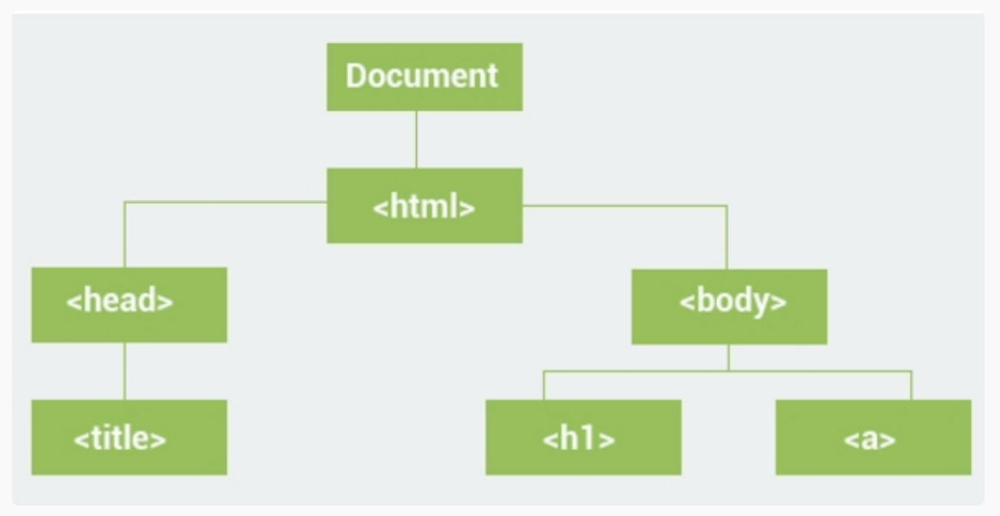
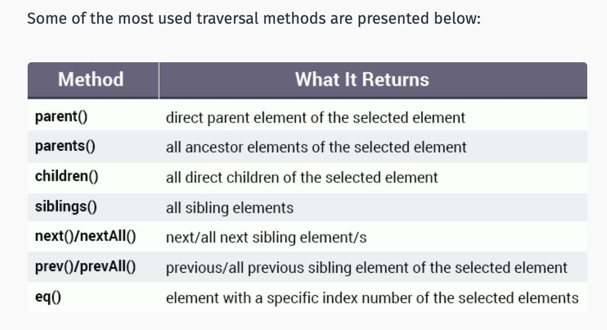
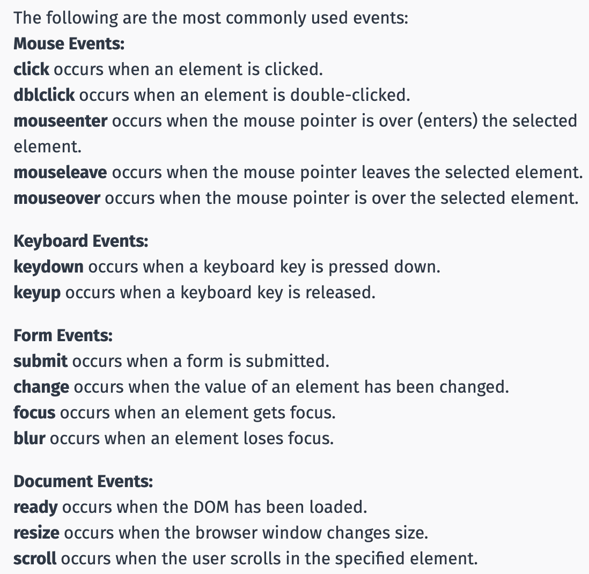
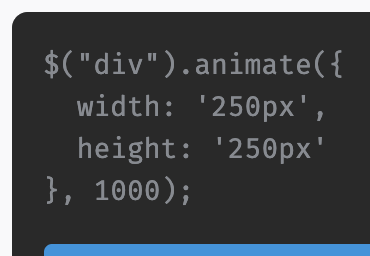
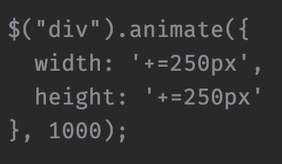
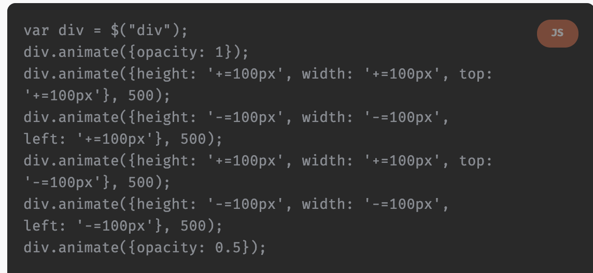

JQuery Notes

Solo Learner Tutorial:

# Selectors:

https://www.sololearn.com/learning/1082/2790/6013/1 


$ call JQuery library 

$("#test") // select the element with the id="test"
$(".menu") //selects all elements with class="menu"

$("div.menu")  // all <div> elements with class="menu"

$("p:first")  // the first <p> element

$("h1, p") // all <h1> and all <p> elements

$("div p") // all <p> elements that are descendants of a <div> element

$("*")  // all elements of the DOM

### For HTML
<!DOCTYPE html>
<html>
    <head>
        <title>Page Title</title>
        <script src="https://code.jquery.com/jquery-3.1.1.js"></script>
    </head>
    <body>
    </body>
</html>

### JS
$(function() {
   // jQuery code goes here
});

# Attributes and Content

The **attr()** method also allows us to set a value for an attribute by specifying it as the second parameter. This will change the href attribute of the <a> element to the provided value.
$(function() {
  $("a").attr("href", "http://www.jquery.com");
});

You can also remove attributes from HTML elements.
The **removeAttr()** method is used for removing any attribute of an element. In the example below we remove the border and class attributes of the table:
$("table").removeAttr("border");
$("table").removeAttr("class");

The **html()** and **text()** methods can be used for all HTML elements that can contain content. **text()** removes html markups
### HTML
<!DOCTYPE html>
<html>
    <head>
        <title>Page Title</title>
        <script src="https://code.jquery.com/jquery-3.1.1.js"></script>
    </head>
    <body>
        <div id="test">
            <p>some text</p>
        </div>
    </body>
</html>

### js
$(function() {
    $("#test").text("hello!");
});
  The code above changes the content of the element with id="test" to "hello!".

  If the content you are setting contains HTML markup, you should use the html() method instead of text().


Another useful method is the **val()** method, which allows us to get and set the values of form fields, such as textboxes, dropdowns, and similar inputs. 

### HTML
<!DOCTYPE html>
<html>
    <head>
        <title>Page Title</title>
        <script src="https://code.jquery.com/jquery-3.1.1.js"></script>
    </head>
    <body>
        <input type="text" id="name" value="Your Name">
    </body>
</html>

### js

$(function() {
    alert($("#name").val());
});

**text()** sets or returns the text content of selected elements.
**html()** sets or returns the content of selected elements (including HTML markup).
**val()** sets or returns the value of form fields.
**attr()** sets or returns the value of attributes.
**removeAttr()** removes the specified attribute.

## Adding Content

**append()** inserts content at the end of the selected elements.
**prepend()** inserts content at the beginning of the selected elements.
**after()** inserts content after the selected elements.
**before()** inserts content before the selected elements.

The jQuery after() and before() methods insert content AFTER and BEFORE the selected HTML element. For example:
### HTML
<p id="demo">Hi</p>

### JS
$(function(){
    $("#demo").before("<i>Some Title</i>");
    $("#demo").after("<b>Welcome</b>");
});

The easiest way of creating a new HTML element with jQuery is the following:
### JS

var txt = $("<p></p>").text("Hi"); 

The code above creates a new <p> element, which contains the text Hi and assigns it to a variable called txt.
Now, we can use that variable as a parameter of the above mentioned methods to add it to our HTML, for example:
## HTML
<p id="demo">Hello</p>

### JS

$(function() {
  var txt = $("<p></p>").text("Hi");
  $("#demo").after(txt);
});

The above mentioned syntax for creating elements can be used to create any new HTML element, for example $("<div></div>") creates a new div.

# Manioulating CSS

jQuery has several methods for CSS manipulation.
The **addClass( )** method adds one or more classes to the selected elements.

### HTML
<div>Some text</div>

### CSS 
.header {
  color: blue;
  font-size:x-large;
}

### JS
$("div").addClass("header");

To specify multiple classes within the addClass() method, just separate them using spaces. For example, $("div").addClass("class1 class2 class3").

The **removeClass()** method removes one or more class names from the selected elements.

The **toggleClass()** method toggles between adding/removing classes from the selected elements, meaning that if the specified class exists for the element, it is removed, and if it does not exist, it is added.

### HTML
<p>Some text</p>
<button>Toggle Class</button>

### CSS
.red { 
  color:red; 
  font-weight: bold;
}

### JS
$(function(){
    $("button").click(function(){
        $("p").toggleClass("red");
    });
});

The code above toggles the class name "red" upon clicking the button.


Similar to the html() method, the css() method can be used to get and set CSS property values. 

### HTML
<p>Some text</p>

### CSS 
p {
  background-color:red;
  color: white;
}

### JS
$(function(){
    alert($("p").css('background-color"));
    $("p").css("backgroun-color", "blue");
});
The code above alerts the background-color property of the paragraph and then sets it to blue.

To set multiple CSS properties, the css() method uses JSON syntax, which is:

### JS
css({"property":"value","property":"value",...});

As you can see, the syntax consists of "property":"value" pairs, which are comma separated and enclosed in curly brackets { }.

$("p").css({"color"; "red", "font-size": "200%"});


## Dimensions

The **width() and height()** methods can be used to get and set the width and height of HTML elements.

Let's set both the width and height of a div to 100px, as well as set a background color for it:
$("div").css("backgroun-color", "red");
$("div").width(100);
$("div").height(100);

The width() and height() methods get and set the dimensions without the padding, borders and margins.
The **innerWidth() and innerHeight()**  methods also include the padding.
The **outerWidth() and outerHeight()** methods include the padding and borders. Does not include the margin by default. You need to pass the boolean value true in order for it to include the margin.

Visual Example @ https://www.sololearn.com/learning/1082/2806/5990/1


### HTML

<div></div>

### CSS 

div {
  width: 300px;
  height: 100px;
  padding: 10px;
  margin: 20px;
  border: 3px solid blue;
  background-color: red;
  color: white;
}

### JS

$(function() {
    var txt = "";
    txt += "width" + $("div".width() + " ";
    txt += "height" + $("div".height() + "<br/>";
    txt += "innerWidth" + $("div".innerWidth() + " ";
    txt += "innerHeight" + $("div".innerHeight() + "<br/>";
    txt += "outerWidth" + $("div".outerWidth() + " ";
    txt += "outerHeight" + $("div".outerHeight();

    @("div").html(txt);
});


# The DOM

The DOM represents a document as a tree structure where HTML elements are interrelated nodes in the tree.
Nodes can have child nodes. Nodes on the same tree level are called siblings.
jQuery traversing is the term used to describe the process of moving through the DOM and finding (selecting) HTML elements based on their relation to other elements.

jQuery makes it easy to traverse the DOM and work with HTML elements.




The <html> element is the parent of <body> and an ancestor of everything below it.
The <body> element is the parent of the <h1> and <a> elements.
The <h1> and <a> elements are child elements of the <body> element and descendants of <html>.
The <h1> and <a> elements are siblings (they share the same parent).

Summary
An **ancestor** is a parent, grandparent, great-grandparent, and so on.
A **descendant** is a child, grandchild, great-grandchild, and so on.
Siblings share the same parent.

The **parent()** method returns the direct parent element of the selected element.

### HTML 
<div> div element
  <p>paragraph</p> 
</div>

### JS
var e = $("p").parent();
e.css("border", "2px solid red");

The code above selects the parent element of the paragraph and sets a red border for it.

## DOM Traversal
The parent() method can only traverse a single level up the DOM tree.
To get all ancestors of the selected element you can use the parents() method. 

### HTML
<body>  body
  <div style="width:300px;"> div
    <ul> ul
      <li> li
        <p>paragraph</p>
      </li>
    </ul>   
  </div>
</body>

## JS
$(function(){
    var e = $("p").parent();
    e.css("border", "2px solid red");
});
The code above sets a red border for all parents of the paragraph.




The **eq()** method can be used to select a specific element from multiple selected elements.
### JS
$("div").eq(2);


## Remove Elements

We remove selected elements from the DOM using the **remove()** method.

### HTML
<p style="color:red">Red</p>
<p style="color:green">Green</p>
<p style="color:blue">Blue</p>

### JS
$("p").eq(1).remove();
This removes Green, the second paragraph element.

You can also use the **remove()** method on multiple selected elements, for example $("p").remove() removes all paragraphs.
The jQuery remove() method removes the selected element(s), as well as its child elements.


The **empty()** method is used to remove the child elements of the selected element(s).

### HTML
<div>
   <p style="color:red">Red</p>
   <p style="color:green">Green</p>
   <p style="color:blue">Blue</p>
</div>

### CSS
div {
  background-color: aqua;
  width: 300px;
  height: 200px;
}

### JS
$("div").empty();
This removes all the three child elements of the div, leaving it empty.


how many siblings does <p> have in the following HTML? 2
```html 
<div>
    <p></p>
        <p id="txt"></p>
    <p></p>
</div>
```

## Handling Events 

JQuery provides an efficient way to handle events. Events occur when the user performs an action, such as clicking an element, moving the mouse, or submitting a form.
When an event occurs on a target element, a handler function is executed.
For example, let's say we want to handle the click event on an element with id="demo" and display the current date when the button is clicked. Using pure JavaScript, the code looks like:

### JS
**Javascript**
var x = document.getElementById("demo");
x.onclick = function () {
    document.body.innerHTML = Date();
}

vs 

**JQuery**
$("demo").click(function(){
    $("body").html(Date());
});

As you can see, the jQuery code is shorter and easier to read and write.
Notice, that the event name is provided without the "on" prefix (i.e., onclick in JavaScript is click in jQuery).

### Commonnly Used Events



As an example, let's change the content of a div when the user types in an input field. To do that, we need to handle the keydown event, which occurs when a key on the keyboard is pressed:

### HTML
 <input type="text" id="name" />
 <div id="msg"></div>

### JS
$("#name").keydown(function(){
    $("#msg").html($("#name").val());
});
The code above handles the keydown event for the element with id="name" and assigns the content of the div with id="msg" the value of the input field.


Another way to handle events in jQuery is by using the **on()** method.
The **on()** method is used to attach an event to the selected element.

$("p").on( "click", function() {
    alert("clicked");
});

As you can see, the event name is passed as the first argument to the on() method. The second argument is the handler function.

The **on()** method is useful for binding the same handler function to multiple events. You can provide multiple event names separated by spaces as the first argument. For example, you could use the same event handler for the click and dblclick events.


You can remove event handlers using the **off()** method.
$("div").on("click", function (){
    alert('Hi there!');
    $("div").off("click");
});
The argument of the off() method is the event name you want to remove the handler for.


## Event Object
Every event handling function can receive an event object, which contains properties and methods related to the event:
**pageX, pageY** the mouse position (X & Y coordinates) at the time the event occurred, relative to the top left of the page.
**type** the type of the event (e.g. "click").
**which** the button or key that was pressed.
**data** any data that was passed in when the event was bound.
**target** the DOM element that initiated the event.
**preventDefault()** prevent the default action of the event (e.g., following a link).
**stopPropagation()** Stop the event from bubbling up to other elements.

For example, let’s handle the click event on an <a> element and prevent it from following the link provided in the href attribute:

### HTML
<!-- <a href="https://www.sololearn.com">Click me</a> -->

### JS
$("a").click(function(event){
    alert(event.pagex);
    event.preventDefault();
});
The code above alerts the mouse position at the time of the click and prevents following the link.

## Trigger Events
We can also trigger events programmatically using the **trigger()** method. For example, you can trigger a click event without the user actually clicking on an element:
$("div").click(function(){
    alert("Clicked");
});
$("div").trigger("click");

This code triggers the click event for the selected element.

The **trigger()** method cannot be used to mimic native browser events, such as clicking on a file input box or an anchor tag. Only events in the jQuery event system can be handled.


## To-Do List
Let's create a To-Do list project using the concepts we have learned.
The To-Do list will be able to add new items to a list, as well as remove existing items.
First, we create the HTML:

### HTML
<h1>My To-Do List</h1>
<input type="text" placeholder="New item" />
<button id="add">Add</button>
<ol id="mylist"></ol>

Clicking the button should add the value of the input field to our <ol> list.

Now, having the HTML ready (above), we can start writing our jQuery code.
First, we handle the click event for the button:

## JS
$(function() {
  $("#add").on("click", function() {
    //event handler
  });
});

Inside the event handler we select the value of the input field and create a new <li> element, adding it to the list:

## more JS
var val = $("input").val();
if(val !== '') {
  var elem = $("<li></li>").text(val);
  $(elem).append("<button class='rem'>X</button>");
  $("#mylist").append(elem);
  $("input").val(""); //clear the input
}

The code above takes the value of the input field, assigns it to the val variable. The if statement checks that the value is not blank and then creates a new <li> element. A button for removing it is added, after which the newly created element is added to the <ol id="mylist"> list.

Here's the complete code:
$(function() {
  $("#add").on("click", function() {
      var val = $("input").val();
    if(val !== '') {
        var elem = $("<li></li>").text(val);
        $(elem).append("<button class='rem'>X</button>");
        $("#mylist").append(elem);
        $("input").val(""); //clear the input
    }
  });
});
**The remove button is not working yet. We will handle it in the next section!


All that is left to do is handle the click event on the class="rem" button and remove the corresponding <li> element from the list.

### JS
$(".rem").on("click", function() {
  $(this).parent().remove();
});

Remember, this is the current object. The code above removes the parent of the current object, which in our case is the parent of the remove button, the <li> element.

### JS 
Completed Code

$(function() {
  $("#add").on("click", function() {
      var val = $("input").val();
    if(val !== '') {
        var elem = $("<li></li>").text(val);
        $(elem).append("<button class='rem'>X</button>");
        $("#mylist").append(elem);
        $("input").val("");
        $(".rem).on("click", function(){
            $(this).parent().remove();
        })
    }
  });
});

## Hide/Show
jQuery has some easy-to-implement effects to create animations.
The **hide() and show()** methods are used to hide and show the selected elements.
The toggle() method is used to toggle between hiding and showing elements.

The **hide/show/toggle** methods can take an optional argument, speed, which specifies the animation speed in milliseconds.
For example, let's pass 1000 millisecond as the speed argument to the toggle() method:
$(function(){
    $("p").click(function(){
        $("div").toggle(1000);
    });
});

The hide/show/toggle methods can also take a second optional parameter callback, which is a function to be executed after the animation completes.

## fadeIn/fadeOut 
Similar to the hide/show methods, jQuery provides the **fadeInfadeOut** methods, which fade an element in and out of visibility.
Just like the toggle() method switches between hiding and showing, the fadeToggle() method fades in and out.

$(function(){
    $("p").click(function(){
        $("div").fadeToggle(1000);
    });
});
Just like toggle(), **fadeToggle()** takes two optional parameters: speed and callback.

Another method used for fading is fadeTo(), which allows fading to a given opacity (value between 0 and 1). For example: $("div").fadeTo(1500, 0.7);

## Slide Up/Down
The **slideUp() and slideDown()** methods are used to create a sliding effect on elements.
Again, similar to the previous toggle methods, the slideToggle() method switches between the sliding effects and can take two optional parameters: speed and callback.

$(function(){
    $("p").click(function(){
        $("div").slideToggle(500);
    });
});

## animate()
The **animate()** method lets you animate to a set value, or to a value relative to the current value.
You need to define the CSS properties to be animated as its parameter in JSON format ("key":"value" pairs).
The second parameter defines the speed of the animation.
For example, the following code animates the width property of the div in 1 second to the value 250px:

$("div").click(function(){
    $("div").animate({width: '250px'}, 1000);
});

You can animate any CSS property using the above mentioned syntax, but there is one important thing to remember: all property names must be camel-cased when used with the animate() method

Multiple properties can be animated at the same time by separating them with commas.



It is also possible to define relative values (the value is then relative to the element's current value). This is done by putting += or -= in front of the value:



To stop an animation before it is finished, jQuery provides the **stop()** method.

## Animation Queue
By default, jQuery comes with queue functionality for animations.
This means that if you write multiple animate() calls one after another, jQuery creates an "internal" queue for these method calls. Then it runs the animate calls one-by-one.


Each **animate()** method call will run one after another.
Remember, to manipulate the position of elements, you need to set the CSS position property of the element to relative, fixed, or absolute.

The animate() method, just like the hide/show/fade/slide methods, can take an optional **callback** function as its parameter, which is executed after the current effect is finished.

## Drop-Down Menu

Let's create a simple drop-down menu that will open upon clicking on the menu item.

### HTML
<div class="menu">
  <div id="item">Drop-Down</div>
  <div id="submenu">
    <a href="#">Link 1</a>
    <a href="#">Link 2</a>
    <a href="#">Link 3</a>
  </div>
</div>

### JS
$("#item").click(function(){
    $("#submenu").slideToggle(500);
});

The code above handles the click event of the id="item" element and opens/closes the submenu in 500 milliseconds.

