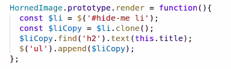
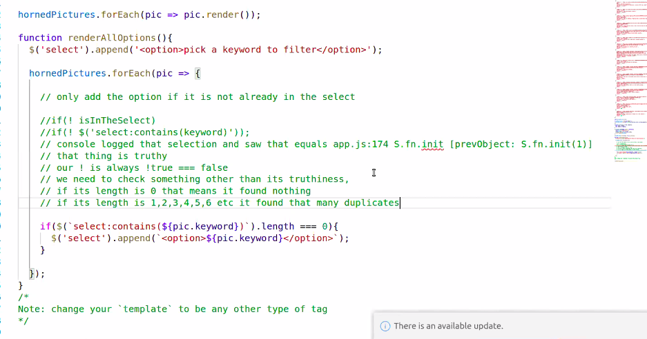
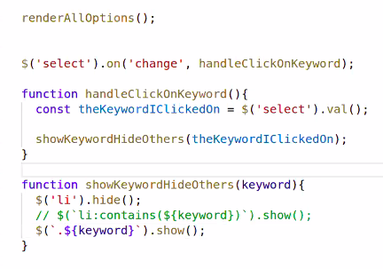
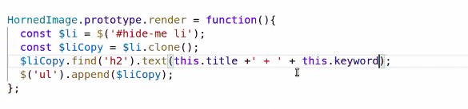
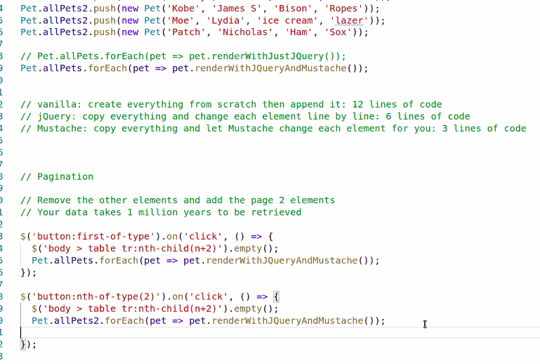

# Code 301 
## Class 3

### Lab 3 tips: 

- HTML tag (aka element)section tag -> to hide things

- .clone copies what's within the element

- also append to the html 

- Go look in the select for duplicate before rendering- if statement.

- jQuery 'contians' method 

- To hide and show, 1. get the keyowrd that was clicked on 2. Show just the li's that contain the keyword

* he added something that I missed. 

## Mustache Library

## Flexbox

display: flex;
flex-wrap: wrap;
justify-content: center (try space-evenly);
align-items: center: (needs height, pulls elements only, while align-content applies to the entire page)
height: 600px;
