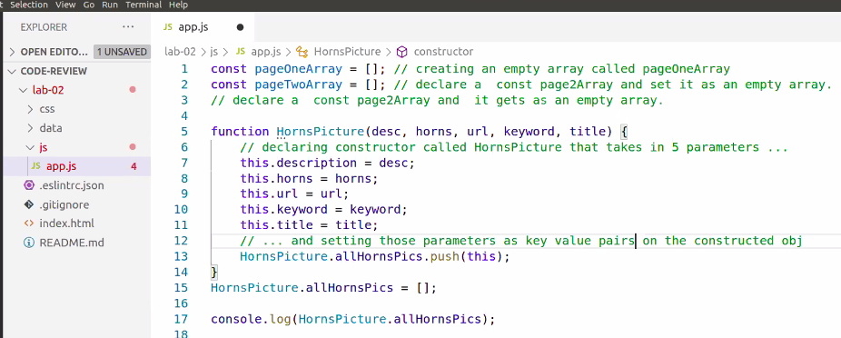
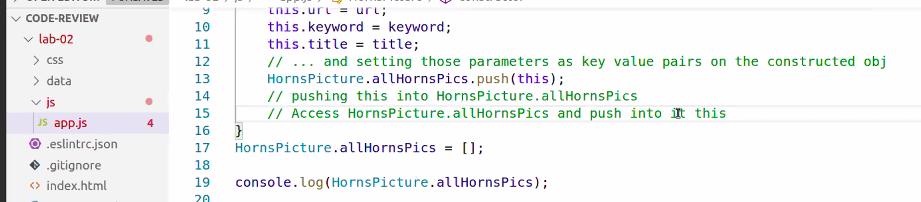
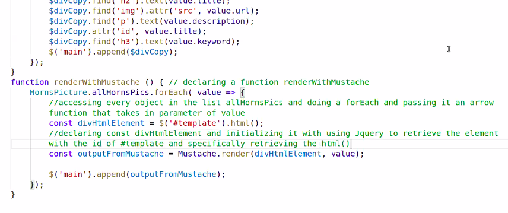
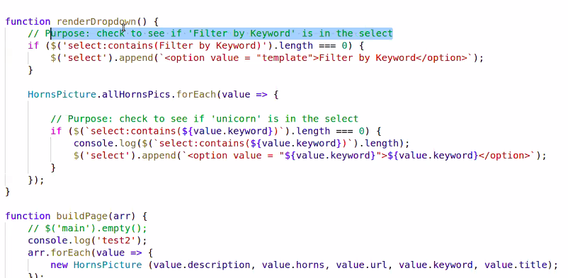
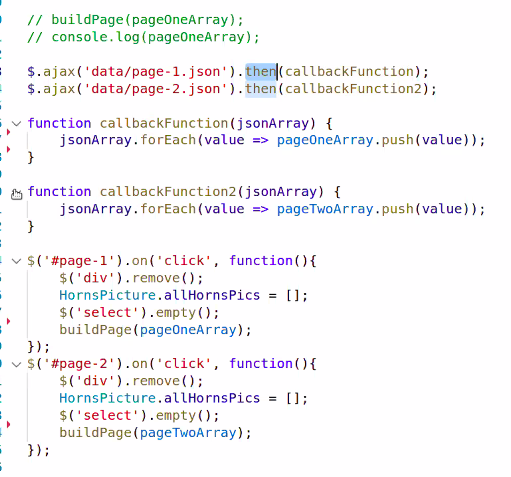
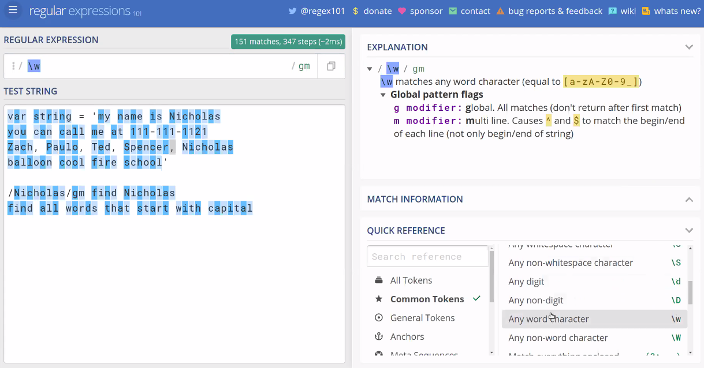
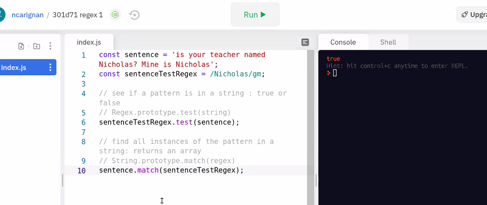
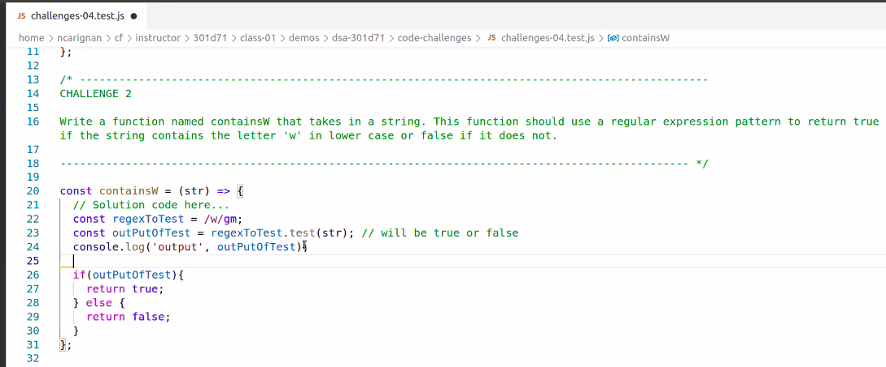
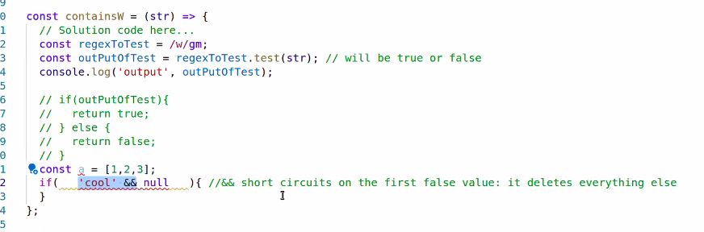
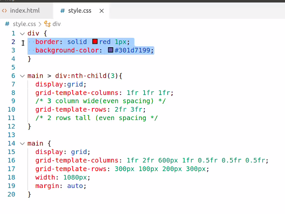

## Warm Up:
- You can click a 
 tag with a 'click' tag, but it will not submit, it only 

- for standard rows in a site grid or flexbox is fine. But for more complex layouts use flexbox?

### Simms Group Review

The .then is needed so it doesn't timeout while aJax loads, NEED IT, then call the function BELOW that line. Ensures it won't take a million JS years and will work.

**Mustache template script tag goes in the HEAD**

**Mustache: we use CDN to load it into our code** 

## RegEx 

**regex101.com** 

inside repl.it

For Code Challenge use /gm for all of them today. Means global and something else.

If else statements make the code easier to read.

|| or statements short circuit(exit early)

JS goes in and deletes cool, and just goes to the false

## Grid / Flexbox

fr = free remaining space 

good height for grid is **100hv** stands for the height of the screen

HEADER/NAV

