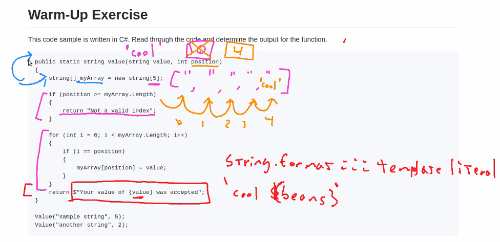

# Code 301
## Class 05 Deployment

## [Warm-Up](https://github.com/codefellows/seattle-301d71/blob/main/class-05/warm-up/warm-up.md) 

- C# example to decipher 

- C# have no variables, only properties or objects

## Deployment

- **WRRC** 

    - "Web Request Response Cycle"

    - Visual representation 

- When Nick asked Spencer to say Hi. Nick was the client bc he requested it. The server was Spencer. 

From terminal: 

- server.js
- npm init

### For Lab today:

### **LAB NEXT WEEK**
jQuery add event listener .on()

.preventDefault needed for event listeners, it just keeps refreshing localhost 

Above is the setup, but the data and the template don't match up (as seen below in the green). So we must adjust them to poperly render but creating an object

Then add on restaurant data 

(below is getting data from the internet, not from server):

