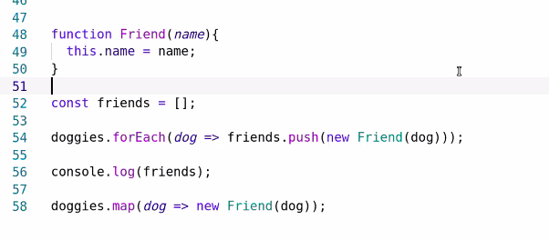
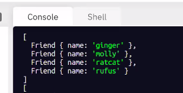

# Code 301
## Class 07 APIs


- snake_case camelCase lowercase UPPERCASE


SHRED TALK

/*
// let newArray = arr.map(callback(currentValue[, index[, array]]) {
//   // return element for newArray, after executing something
// }[, thisArg]);
**array.map returns a new newArray.**
.map's purpose is to create new arrays from the array it is called from

The array is made up of whatever is returned by the callback, each time it is called;

/*

const letter = ['a', 'b', 'etc'];

letters.map((value, index, array) => {
  return 2;
})


- Use return after .map function, which will then return the array it created. I do not create the array.





``` javascript
const nums = [1, 2, 3, 4, 5];

const newNums = nums.map(numStuff);

nums.map(numStuff);

function numStuff(valuePotato, idx, arr){//usually only use valuePotato and drop idx and arr
    return 1 + ind + valuePotato;
}
console.log(newNums);
```

LAB TODAY:

location, weather and parks need to get going to day. Rest can wait


superagent goes out to the internet and fetches data from other servers for us

add API key to .env
LOCATION_API_KEY=numbernumbernumberforever 


npm install -s superagent
run nodemon

Fuck with Postman.com for URL/API things. URL error reduction