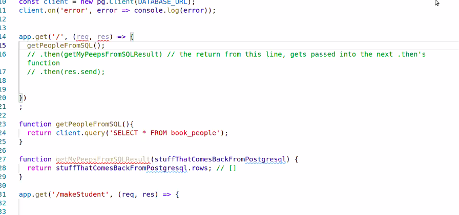
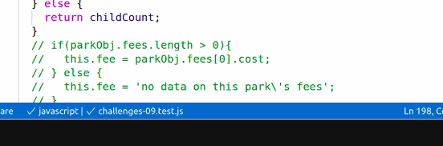

# Code 301
## Class 09 SQL Continued


- **floor divide** means divide and chop off the decimals.

- npm install -s superagent (or express or whatever module, if it doesn't save with just npm install. check package.json to see if it saved in dependencies)

- call stack trace ie - /parser.js:278:15 


### **.reduce()**
    **aka SLAP CHOP**
- Purpose is to take any array and reduce it down into anything else.
- It can take veggies and turn them into a salad.

arr.reduce(function(reducer, currentValue){
    whatever ets returned, gets passed down to the next iteration of the function call, as the new reducer
});

- Can take in an 
[optionalStartingReducer]

add(numbers[0], numbers[1]) 


Prom? 


kind of like .map()


kind of like .filter()


To smoosh arrays in a more advanced setting thna above:
```javascript
const craziness = {
  cool :{
    thing: 'bazooka'
  },
  wow: {
    monster: 'mash',
    graveyard: 'smash'
  },
  nums: {
    1: '1',
    2: '2',
    3: '3'
  }
}

const arr = Object.values(craziness);
console.log(arr);

const startingAccumulator = {};
arr.reduce(flattenObj, startingAccumulator);

function flattenObj(objectWeAreBuilding, objectWeAreStealingFrom){
  for(let key in objectWeAreStealingFrom){
    objectWeAreBuilding[key] = objectWeAreStealingFrom[key];
  }
  return objectWeAreBuilding;
}
```

I think this is the right code for refactoring




**currying** wrapping a function in another function so it can receive the variables it needs.





Class 10:

WRRC : Web Request Response Cycle

