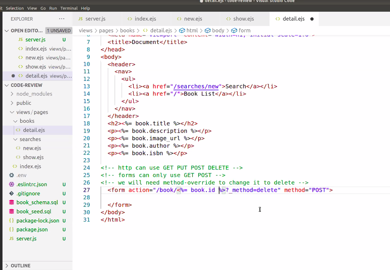
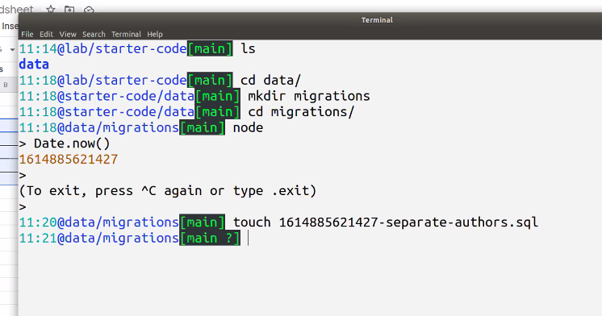

# Code 301
## Class 14 Update and Delete

 
 
 

## Brian Nations on Diversity and Inclusion

- Use diverse (non-traditional)background in personal pitch.

- Diverse teams out-perform non-diverse teams.

Lecture started at 10:16am for bookapp review

HTML ONLY KNOWS GET/PUT AND POST/DELETE ie forms can only use GET or POST (also, need method override to change to POST)

book_app review:

Date.now() - time stamp to the milisecond since 1970.

FOR LAB 14 started at 11:20am-ish

Matt's question at 11:55am, start watching THERE