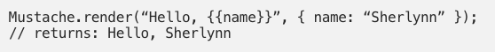
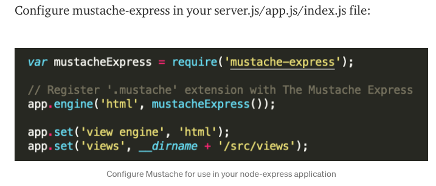
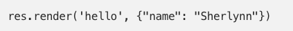
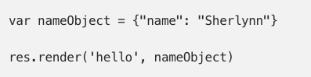
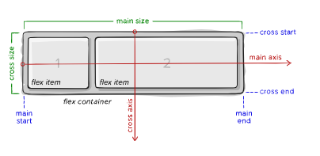
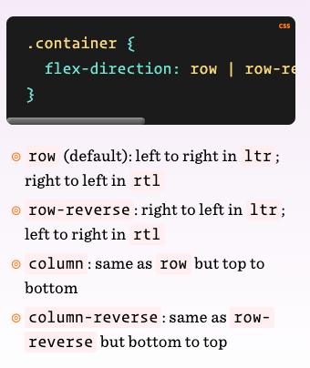
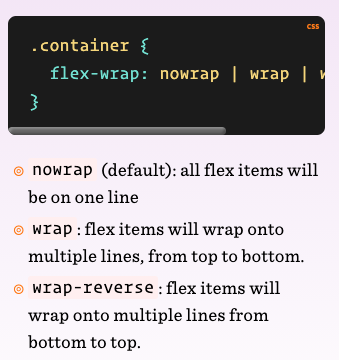

# Code 301
## Reading 03: Mustache and Flexbox

## Mustache and Flexbox

Articles:

[JS Templating Language and Engine](https://1sherlynn.medium.com/javascript-templating-language-and-engine-mustache-js-with-node-and-express-f4c2530e73b2)

[A Complete Guide to Flexbox](https://css-tricks.com/snippets/css/a-guide-to-flexbox/)

[Work Through These Tutorials on Flexbox](https://flexboxfroggy.com/)

## JS Templating Language and Engine

- "Mustache is a logic-less template syntax. It can be used for HTML, config files, source code — anything. It works by expanding tags in a template using values provided in a hash or object."

- Supports various languages.

- Above, double curly braces are around the name to show it's a **placeholder.**

- **NOT A TEMPLATING ENGINE**

## A Complete Guide To Flexbox
(https://css-tricks.com/snippets/css/a-guide-to-flexbox/)

- Parent Element = Flex Container

- Child Element = Flex Items

- **main axis** - primary axis along which flex items are laid out. Not necessarily horizontal, that depends on flex direction

- **main-start** | main-end - "The flex items are placed within the container starting from main-start and going to main-end." 

- **main-size** - flex items width or height. flex item’s main size property is either the ‘width’ or ‘height’ property, whichever the main dimension.

- **cross axis** - direction depends on the main axis direction

- **cross-start | cross-end** - "Flex lines are filled with items and placed into the container starting on the cross-start side of the flex container and going toward the cross-end side.
"

- **cross size** - height or width of a flex item, whichever its cross dimnesion is the item's cross size.

## Flex Directions

## Flex Wrap

- By default, flex items will try to fit onto one line.

