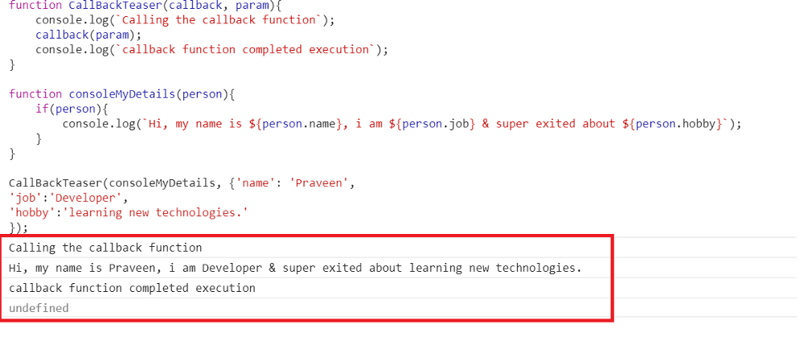
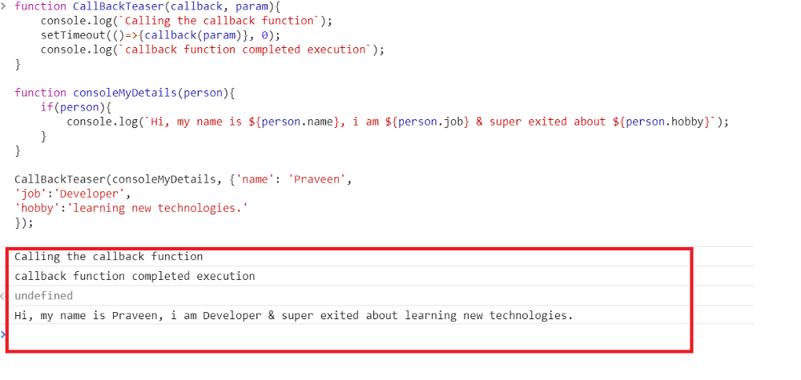

# Code 401: Advanced Software Development in Full-Stack Javascript

## Reading 01: Node Ecosystem, TDD, CI/CD

**Array.map()** takes a list of things (or numbers), runs it through a filter of sorts, and returns a new list of things of an arbritrary length.

**Array.reduce()** takes a list of things, and runs it through a filter, different than previously mentioned,in a effort to change the things inside of the list. It then produces a new list that looks different than the frist, and the first remains in its original form.

### Superagent call to API:

### Promise Syntax:

```javascript

function showResults(req, res) {
    superagent.get(`https://maps.googleapis.com/maps/api/directions/json?origin=${req.query.origin}&destination=${req.query.desination}&key=${process.env.PLACES_API_KEY}`)
        .then(results => {
            res.render('./pages/results');
        });
}
```

### Async Await Syntax:
```javascript

async function shwoResults(req, res) {
  try{
    const results = await superagent.get(`https://maps.googleapis.com/maps/api/directions/json?origin=${req.query.origin}&destination=${req.query.desination}&key=${process.env.PLACES_API_KEY}`);
    console.log(results);
  }catch(err){
    console.log('Something went wrong...', err.message)
  }
}

showResults();

```

### Promises Explained:

- A promise is a pattern for writing async Javascript. They are similar to callbacks in that they execute some code and then continue on, while the previous code finishes running. 

### Not Callback Functions are Async

- Not all callbacks are async, some are synchronous, it depends on the syntax and/or use case. For example below is synchronously written:



Comparatively, here it is in async:



Source Medium.com : [Callbacks — Synchronous & Asynchronous](https://medium.com/@pravngaur/callbacks-synchronous-asynchronous-62bac2b8fe85)