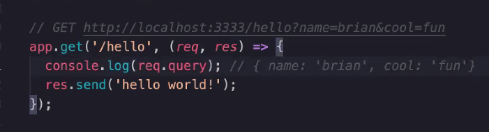

## WRRC (Web Request Response Cycle)

HTTP is stateless

Req:

1. Method (aka REST verbs)

2. Body (put or post request)

3. Headers ()

Res:

1. Status

2. Body 

3. Headers: more information coming back from the response ie user profile, saved via a cookie or local storage)

**MUST MEMORIZE THIS FLOW**

Server: Doesn't save anything. Sends a query to a DB for the information. DB's store the data, obv.

**Time 9:27am)**
Middleware is an express tool for us. We require express on our server. So it happens on our server, and it adjusts our req, res if we updated or changed it. 

Route -> MW -> req,res

next() moves onto the next thing, ie from mw to mw2 below:

## REST (verbs)
GET -> Create
POST -> Retrieve
PUT -> Update
DELETE -> Delete

## CRUD 
CREATE
RETRIEVE
UPDATE
DELETE

## TDD -> Test Driven Development -> Red, Green, Refactor 

# WorkFlow: 
(9:51am)
1. Create repo in github
1. go to actions tab and select node.js workflow
1. clone down to machine
1. npm init -y (initalize)
1.  npm i (installs the dependencies in the package.json)
1. npm i express (I know I'm building an API server and we use express for that) Express is a decendency for production
1. npm i jest (bc we use jest for testing) supertest (these are dependencies for testing, not production)
1. git checkout -b dev
1. touch index.js
1. mkdir src

root: starts the app for us, the rest lives in src

in src folder
1. touch server.js
1. mkdir middleware (and) handlers
1. 

'use strict';
  - JS 'strict mode'
  - doesn't let us write some crazy ass code that works but it bad form/syntax? No hacking?

File order:
1. server.js

1. index.js

dotenv is a 3rd party module that allows us to 

(see yesterdays syntax for a comparison. This is cleaner syntax)

**THEN** 

1. node index.js
1. npm run start

Start Script should be: (10:30am for explanation)

add start-watch, see front row for good explanation

Boilerplate: (parses the json data?)

**THEN**
1. touch 404.js 500.js

**404** 
(req, res, next) makes this middleware bc of the 'next'

Use this example:

**500**
500 generic server error, lazy developer blanket error. User makes request, something didn't work on our end, returns 500 error (app error?)

This is the final middleware, so we don't need to use a next, there's nowhere else to go, it's the last one.

Added error routes

"Catch All Route" '*'

## logger.js

add logger.js to middleware

whenever a server request is made, it logs it. if it sits in a route then it only effects that route. but if it sits on globally then it hits all of them

** NEXT **
1. npm run start-watch
1. http: 3333

Debugging and URL Explanation (11:11am)

TDL: Top Level Domains .com .uk

Query Strings are legacy (outdated)

### Make our routes look better:

Go use swaggar inspector 

**helper function**
They help the file along? (11:27am)

we threw an error in - square('cat') does not equal number, so it goes next to the 500 error

SO we do this:

line 37 works in order, cool -> square -> req,res

Function returns a function = **function currying**

## Post Request
 server.js file: 

req.body -> (form data is req.body.name [or username or password, etc])

we do this moddule.exports in order to test our code, in memory testing

## TESTS 
(11:40am)

server.test.js

### Mock Request Engine
const supertest = require('supertest');

creates fake environments, fake api calls, etc, so we don't have to hit our real servers. Supertest runs this test like a server, but in a mock environment.

### 3 things needed for tests

- **describe** -> test suite -> gives me a series of tests for a module
- **it** -> individual tests as part of the test suite (it should let me make a get request, it should return 500 for an error, etc)
- **expect** -> "assertions" -> granular parts of an individual test (expect res.body to be _____, etc)

**describe block:**

label like: 

Test the things that don't work 

## DO NOT DO
This is a bad way, of course true = true. Bullshit tests. Make sure they have meaning.

## Do THIS

expect(response).toBe('a string'); (check that syntax)

Modify your code to pass your test, don't modify your code to pass your tests.

NEXT: 
1. get status
  then add specific files to gitignore
1. gitignore
  
1. ACP to dev branch
1. PR to main branch 
1. Make sure the tests pass on the Actions tab. Node.js workflow should work, but if it doesn't, use the one from yesterday (copy and paste in github, can be found on 401 Github config file)

## CodeChallenges: 
(12:08pm)

Whiteboard Challenge Workflow: (see documentation)

 (12:17pm ^)

## LAB 
Readme for lab:
- heroku deployed url 
- UML diagram (Web request response diagram) whiteboard WRRC (what he drew out this morning)
- 

app.get/person
expect: query string 

Scaffolding:
- do logger and validator tests (need to explore validation test)
