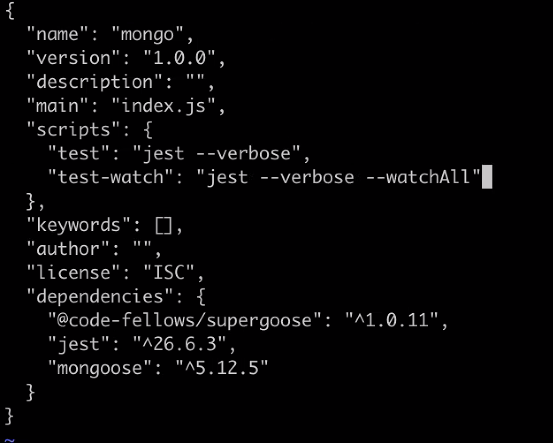
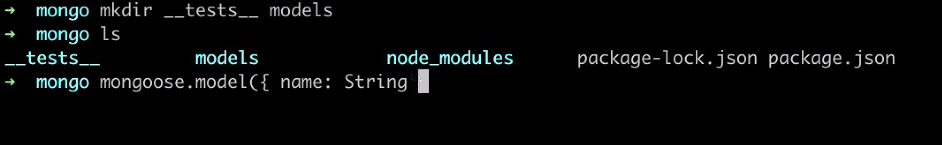
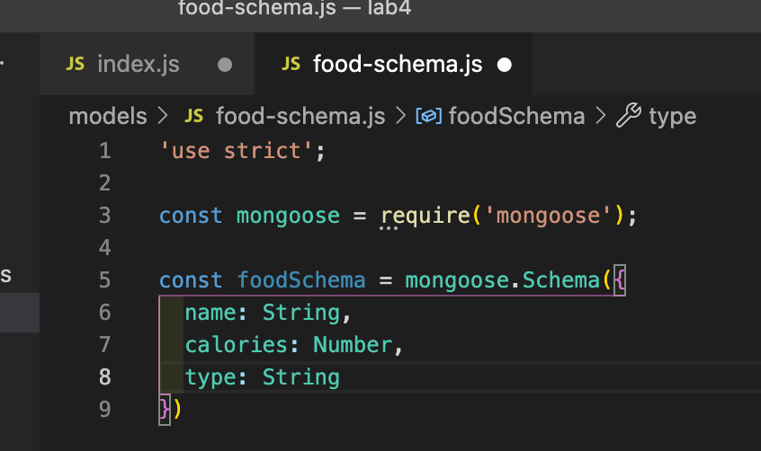
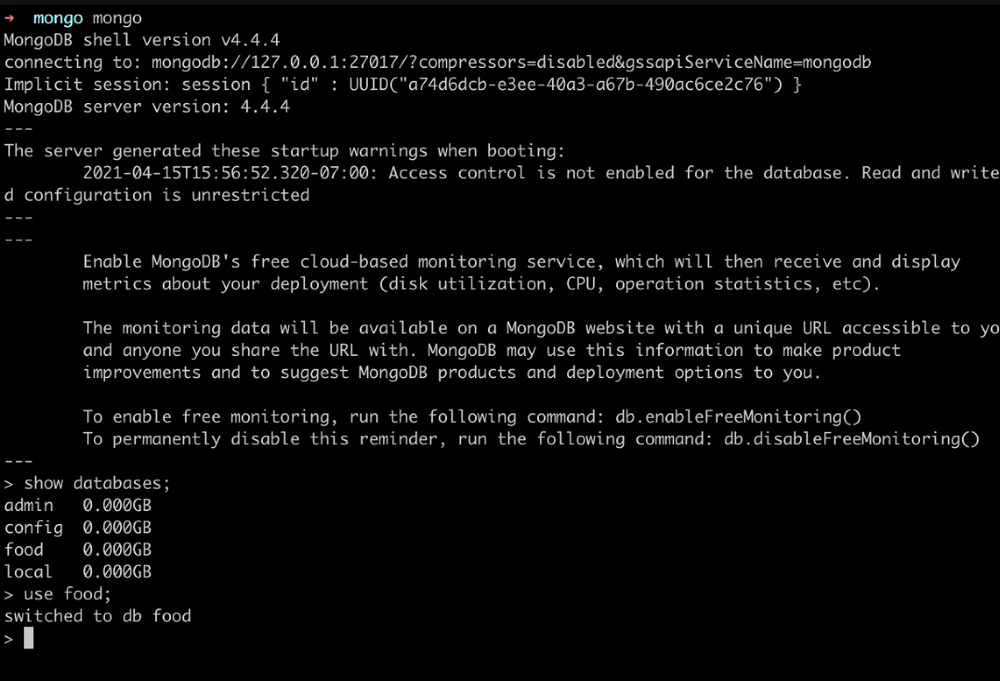
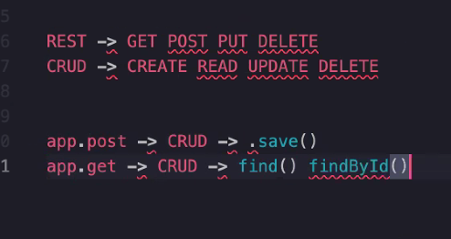
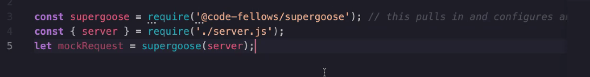
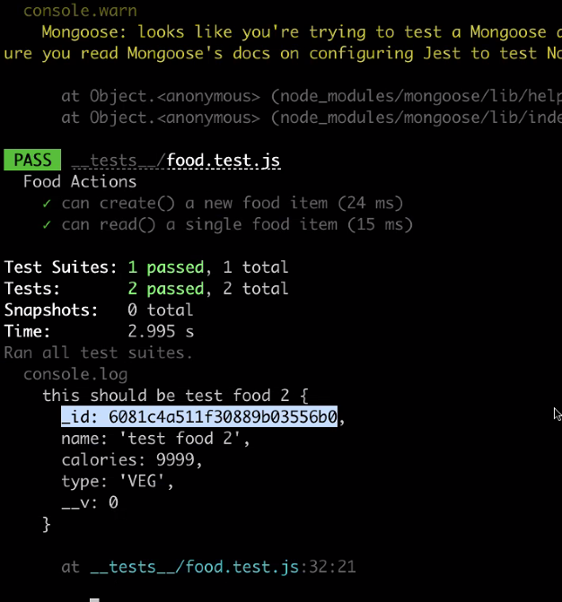

# Code 401 Class 04

# Mongo DB

- SQL -> database management system -> relational data

## Document Based Storage -> DBMS

Mongo DB is a DBMS

Mongoose - allows us to connect to a Mongo DB 

mongo shows it's there (the shell)
mongod starts it

### Methods for Mongo DB:

  1. .save() -> CREATE -> POST

  1. .find({}) -> READ (return everything in the DB) -> GET

  1. .find({ username: 'bnates' }); -> GET
  
  1. .findById('12345'); 

  1. .findByIdUpdate('123345', { username: 'bnate' })
  
  1. .findByIdAndDelete('12345');
  
  - To find Mongoose methods see Mongoose API docs

GUI (gooey) - Graphical User Interface

In terminal : mongod (starts process), mongo (shell, doesn't let us do anything 9:49am)

1. mongod
2. mongo
3. show dbs

.pretty() (returns data in a pretty object)

**DEMO at 10:07am** 

in mongo directory
1. npm init -y
1. npm i mongoose jest @code-fellows/supergoose 
    supergoose is Code Fellows combining super test and mongoose


1. mkdir __tests__ models 



1. in models - touch food-schema.js food-collections.js

1. __tests__ touch food.test.js

1. build models of our food

- a Schema is basically a model (10:21am)

 We can do this like, but it's vague


Database Arcitechture: we deside constraints to get the data we want back

enum: more contraints 
``` javascript
const foodSchema = mongoose.Schema({
  name: { type: String, requires: true },
  calories: { type: Number, required: true },
  type: { type: String, uppercase: true, enum: [ 'fruit', 'vebegtable', 'meat']},
})
```
_id = know it's mongo db



Terminal: 
show collections

10:46am- 


Models @ 11:08am

Mongoose is an ORM (object related _____)

FINAL STEP = WRITE TESTS

Yesterday we did this in tests:



Today we're doing this:
```javascript
require('@code-fellows/supergoose'); //this pulls in and configs and runs mongo memory server and supertest
```

We're testing to make sure our CRUD works, and our wrapper methods

at 11:36 talks about validator tests

Once tests are written, run in terminal npm run test

PASSES:
