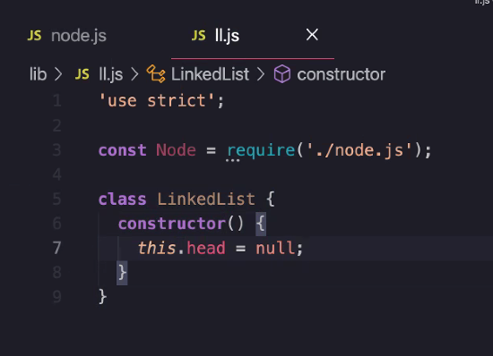
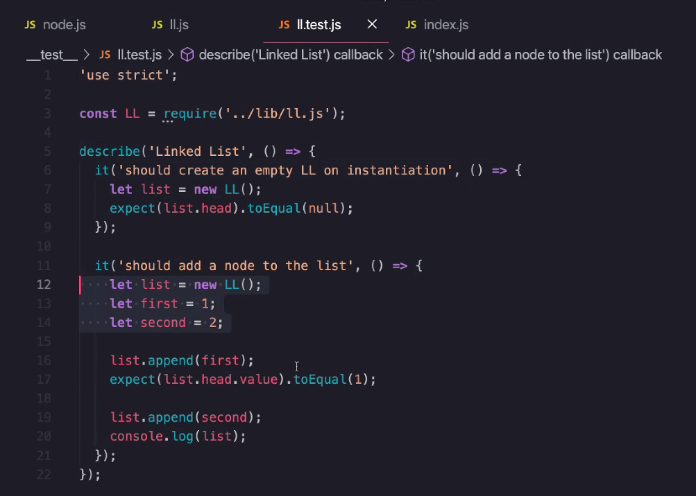

# Code 401

## Data Structures and Algorithms Lecture #1 Linked Lists

- Array is a data structure to hold data.

- Primitive data type: number, string, boolean, null

- Algorithm: Series of instructions to build a thing. Steps to get from point A to point Z.

- Big O Complexity: Describes the complexity of the algo


[Big-O Complexity Chart and article](http://biercoff.com/big-o-complexity-cool-cheat-sheet/)


logarithimc time -> BST Binary Search Tree -> "divide and conquer" algorithm.

for loops = O(n)
nested for loops = O(n^2) which is super inefficient.


- Head: beginning

- Tail: contains a next: null;

```javascript
if(next === null)
return 'end of linked list'; 
//something to that effect
```

- SLL : Singly Linked List

"Determine is a something is circular"?  

"can you tell me the size of the linked list?" To ask interviewer 


##  [Swift Algorithm Club - Github](https://github.com/raywenderlich/swift-algorithm-club)

## Make a LL


Also need to make TESTS


EXAMPLE OF HOW THE DATA(node) LOOKS:


Node Constructor:




We don't need to know what the tail is in a LL bc it's null.

next, add(append) a value to the node - adding a single item to the first node below


To traverse a LL memorize below:


KNOW current.next -> I'm moving down the list, reset current.next

return this;


## index.js


in terminal: 


ll.appends(assets/20);
console.log()


## tests



npm init -y

npm i -D jest (-D applies as a developer dependency, it's just a dev tool. Then it doesn't push the package up to heroku which is unnecessary bc apps run without it. Jest is just for dev testing)


PASSED


Coverage Report:


Apps are expected to pass tests at 90-95%. (Industry typical)

Write JS in Chrome Console to play with code 


## MERN stack -> mongo express react node (only Javascript! You can build anything with JS)

## LAMP stack -> linux apache mysql php (old stack, arcitecture, arcitecture, arcitecture, language)

