# Code 401

## Data Structures and Algorithms Lecture #2 Stacks and Queues

## Resources: 

## [Medium Article Stacks and Queues with code](https://medium.com/swlh/stacks-and-queues-simplified-ef0f838fc534)

## [Visualgo](https://visualgo.net/en/list)

## Stacks

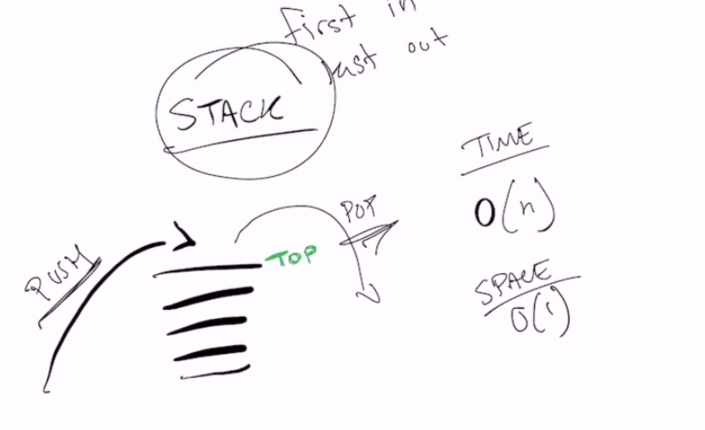

- LIFO - last in first out

Common terminology for a stack is

- Push - Nodes or items that are put into the stack are pushed

- Pop - pop it off the top

    Nodes or items that are removed from the stack are popped. When you attempt to pop an empty stack an exception will be raised.

- Top - This is the top of the stack.

- Peek - Tell me the top

  When you peek you will view the value of the top Node in the stack. When you attempt to peek an empty stack an exception will be raised.

- IsEmpty - returns true when stack is empty otherwise returns false.

Time: 0(n)
Space: 0(1)

Pseudocode:

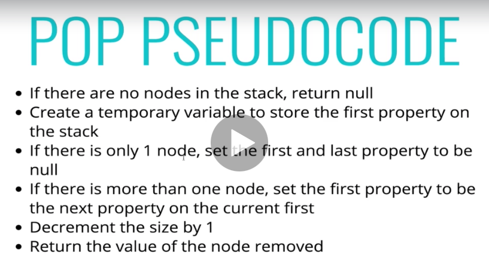

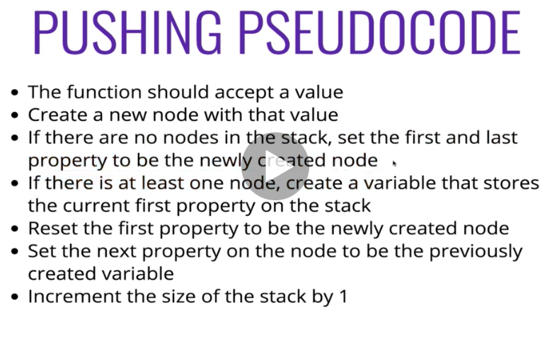

## Queue:

- FIFO - first in first out (ie waiting in line)

- Enqueue - Nodes or items that are added to the queue.

- Dequeue - Nodes or items that are removed from the queue. If called when the queue is empty an exception will be raised.

- Front - This is the front/first Node of the queue.

- Rear - This is the rear/last Node of the queue.

- Peek - When you peek you will view the value of the front Node in the queue. If called when the queue is empty an exception will be raised.

- IsEmpty - returns true when queue is empty otherwise returns false.

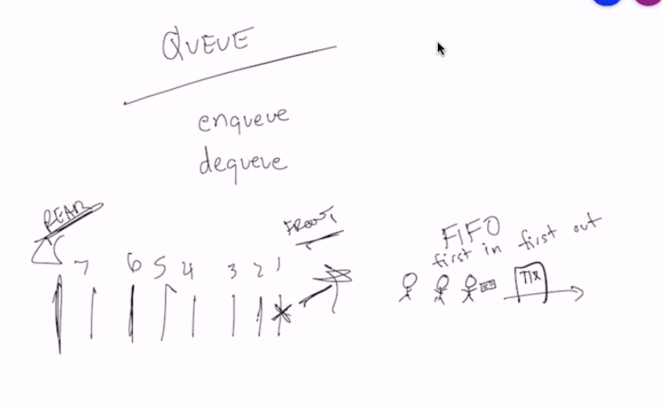

Pseudocode:

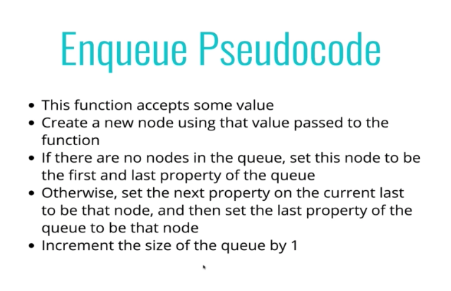

- You can implement a stack with a queue? @ 15 minutes

NEED TO KNOW (for interviews):

Hashmaps and hash tables (this is an object?) @16:15

## DEMO @ 18:25

29 minutes:
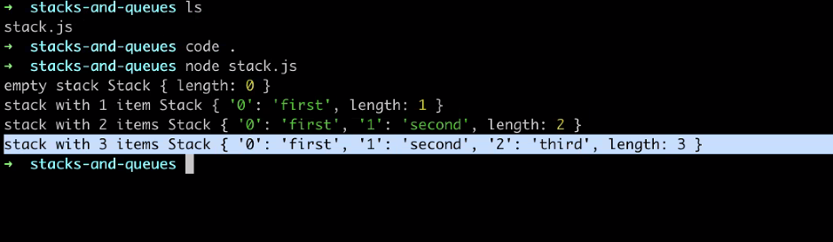

Push:
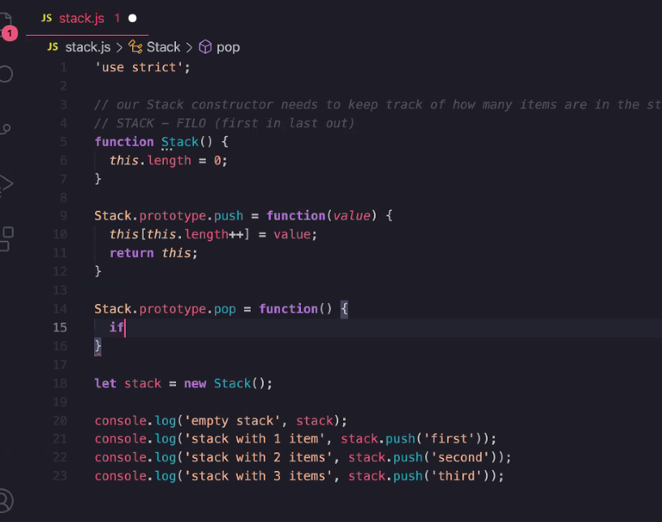

Pop:
--this.length = remove the item, instead of ++ to increment by 1

33minutes:
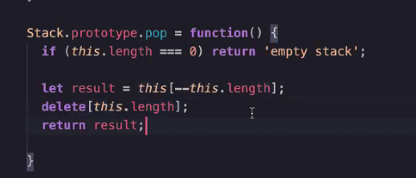

delete is removing an item from the stack, we need it to be gone

35 minutes:
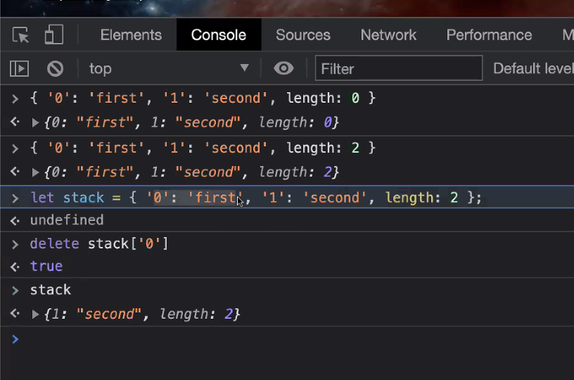

### Peek
36 minutes-
peek is like pop, but no deleting it (remove the delete)

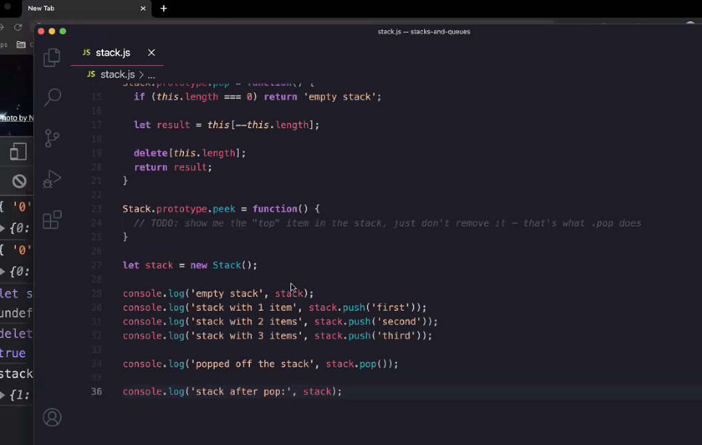

this result is not what we wanted

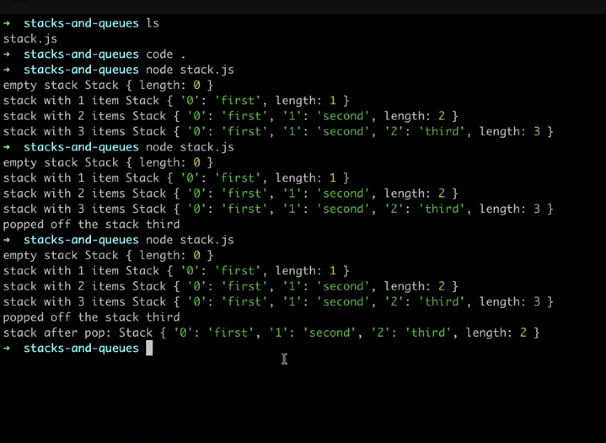

Had to edit the delete as seen below
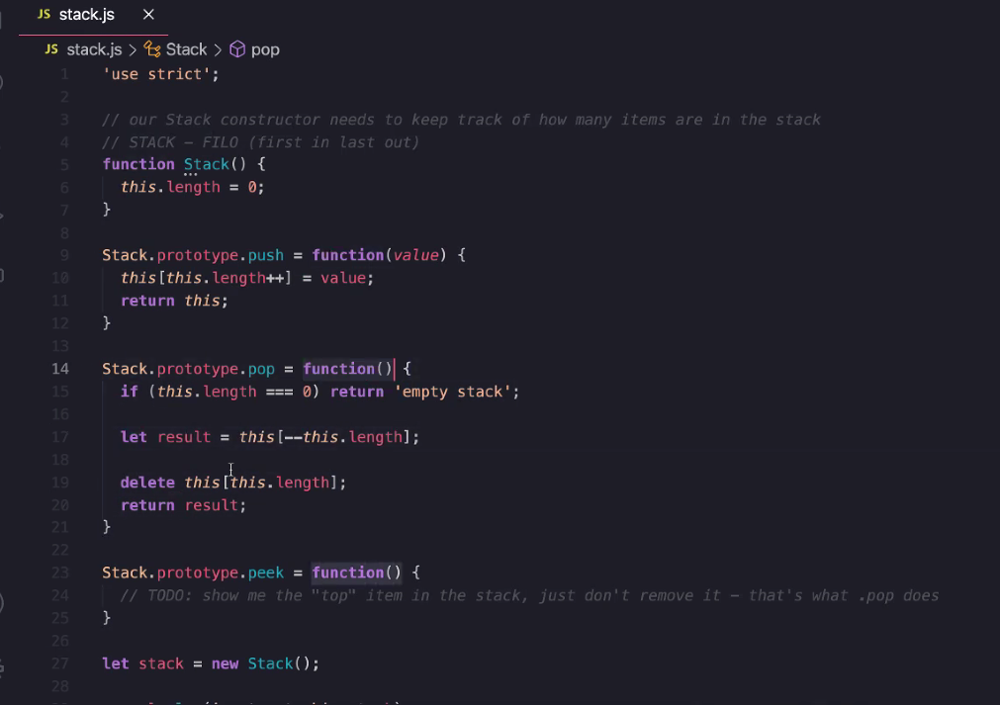

This is correct:
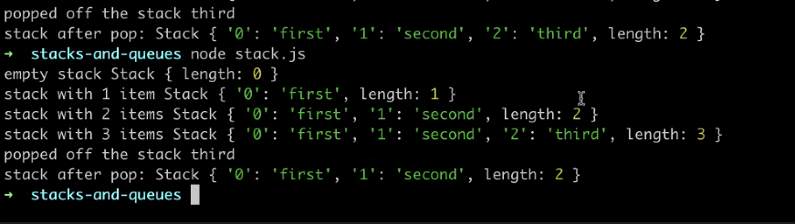

## Queue (43 minutes)

enqueue - add a value to the queue

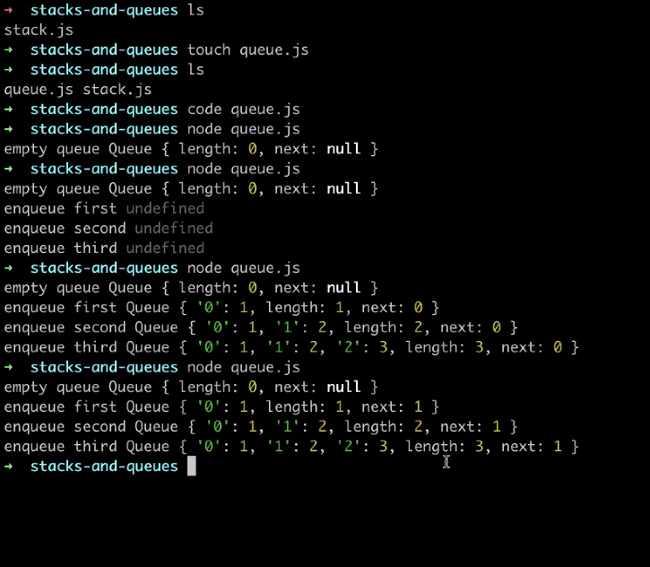

54:30

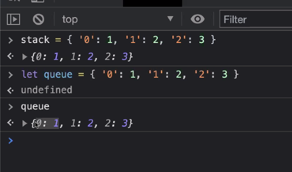

55 for visual explanation:

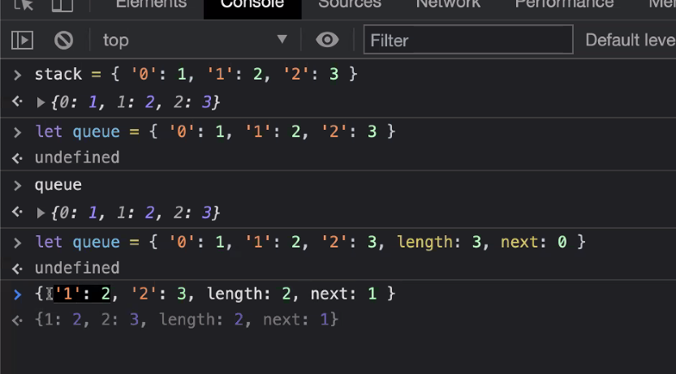

dequeue needs next

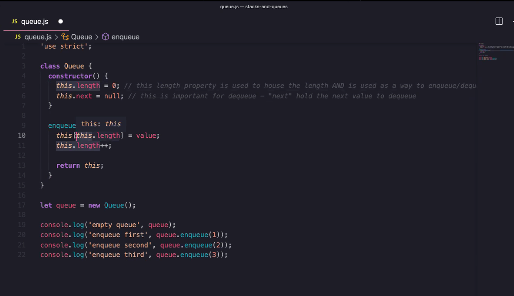
