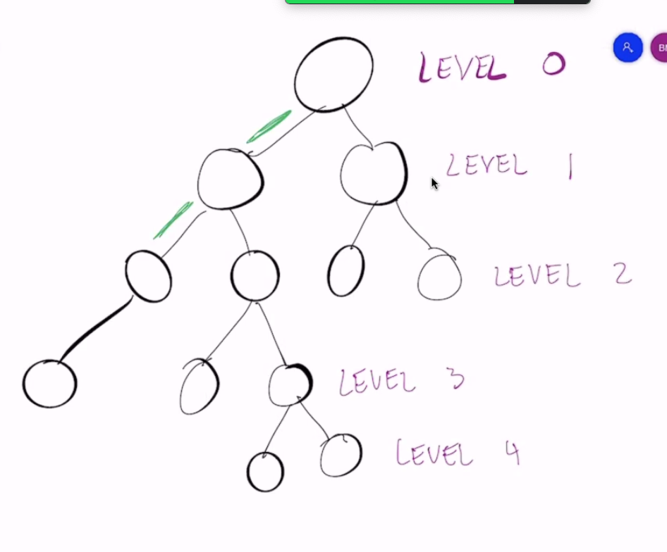
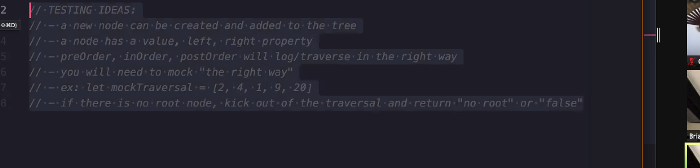

# Code 401

## Data Structures and Algorithms Lecture #3 Trees

## Binary Tree (BT)

    - Hierarchal data Structure to collect data in a recursive format

- Not a BST (higher level than a BST)

- The DOM is a binary tree

- **O(n)**

- Only 2 nodes (children) per parent - bi

- Leaf node: if left/right= null, then you're at end of the path on the tree, at a leaf

      left: null
      right: null

- Height = 4
- level 0 = root
- Nodes on the same level are siblings

## DFS (Depth First Search)

- Most efficient method of traveral. Done recursively.

  3 strategies for DFS (traversal):

  - The order of processing a node

  1. Pre Order Traversal - Data, L, R

  - When you're going through this tree, searching, start by reading the data of the node you're on.

  - Then we go as far left as we can go, until we hit a leaf node.

  - Then we go as far right as we can go

  1. In order

  - L, Data, R

  1. Post Order

  - L, R, Data

## BFS (Breadth First Search aka 'Level Order Traversal')

  (7:30)

## Binary Search Tree (BST)

- Is a BT

- More efficent than a BT

  - **O(log n)**

# Code demo at 22 minutes

    mkdir binary-tree
    touch binary-tree.js index.js node.js 

recursion breakdown @ 30 minutes-ish

Traversal visual @ 48:30

## HINT @ 52:45-53:30 AND 1:09:45 (for lab)

## HINT: 1:19:13 for testing

## HINT 1:30-1:31

Testing:

