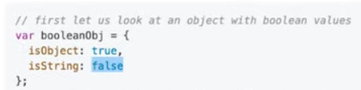
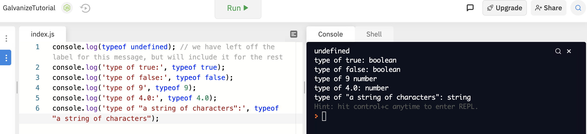
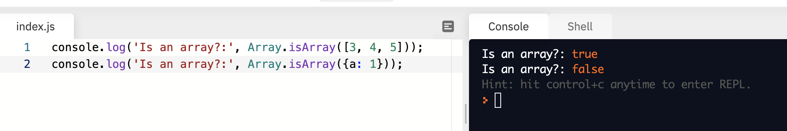

## Galvanize JS Tutorials


Modulo % 
- anyOddNumber % 2 will always evaluate to 1
- anyEvenNumber % 2 will always evaluate to 0 

scalar data types:
- undefined
- boolean
- number
- string

## Collections of Data:
- **array**
- **objects**
  - collection of properties
  - key-value pairs
  
```javascript
var variableName = { //the properties are in the curlies
  key: value, //properties are the key-value pairs
  key: value //property
}; //object overall has two properties 
```

**typeof operator**
it tells you the type of value in question

For an Object:


For an Array:


Return Values for Functions:

```javascript
//Example 1

//first, we will declare a function that takes an object parameter and returns it
function returnObject(object) {
  return object;
}

var user = {
  id: 4,
  name: 'Robert Solomon',
  occupation: 'Mathematician'
}; // we are defining a variable that we will pass to our function as an argument
var resultObject = returnObject(user); // now, we call the function with 'user' as our argument
console.log('resultObject:', resultObject);

//Example 2

// next we will declare a function that takes in an object, and a key, and returns the value located at the inputted key
function returnAValue(obj, key) {
  return obj[key];
}

var computer = {
  name: "MacBook Pro",
  version: "10.14.6",
  processor: "2 GHz Intel Core i7",
  memory_gb: 8
};
var nameOfKey = "version";
var valueAtKey = returnAValue(computer, nameOfKey);
console.log('valueAtKey:', valueAtKey);

//Example 3

// we will now declare a function that takes no parameters, creates an object, and returns the newly created object
function createAndReturnAnObject() {
  var newObj = {a: 1, b: 2};
  return newObj;
}

var resultObject = createAndReturnAnObject();
console.log('resultObject:', resultObject);
```

## Operators and Methods

- An **operator** is used to perform specific computations or operations on operands
  - ie =+-/* and ** (exponent) and typeof

Exponent Example:
```javascript
var power = 2 ** 5;
console.log('power:', power);
```


- A method is a function that is a property of an object
  - ie console.log and Array.isArray()

**plus-equals**
```javascript
var totalUnitsOfCargo = 11;
var additionalUnits = 2;
totalUnitsOfCargo += additionalUnits;//line below is the verbose version of this line, they do the same thing
// totalUnitsOfCargo = totalUnitsOfCargo + additionalUnits
console.log('totalUnitsOfCargo:', totalUnitsOfCargo);
```