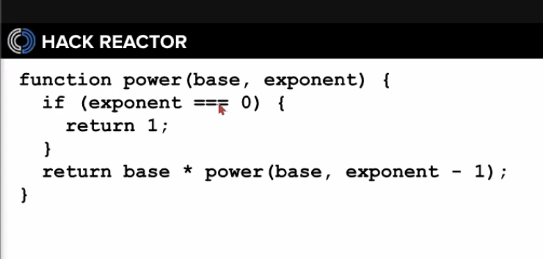
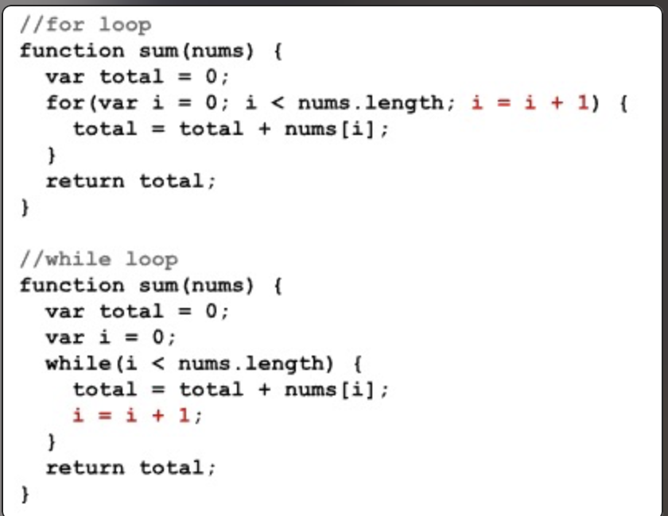

Git is "version control platform"

Keywords are important!

Array "ordered collection of values" In JS we can think of arrays as one kind of value which represents a grouping of subordinate values.

.length - 
.push -
.pop - 
.shift - 
.unshift -

