# Javascript Cheatsheet 

## Javascript array.prototype.methods:

```javascript
.join() //joins all elements of an array into a string

    const joinArray = (arr) => { 
        return arr.join(' '); //arr.join([separator])
    };
        // expect(joinArray(['hello', '301', 'students'])).toStrictEqual('hello 301 students');

.concat() //used to merge two or more arrays. This method does not change the existing arrays, but instead returns a new array.
```

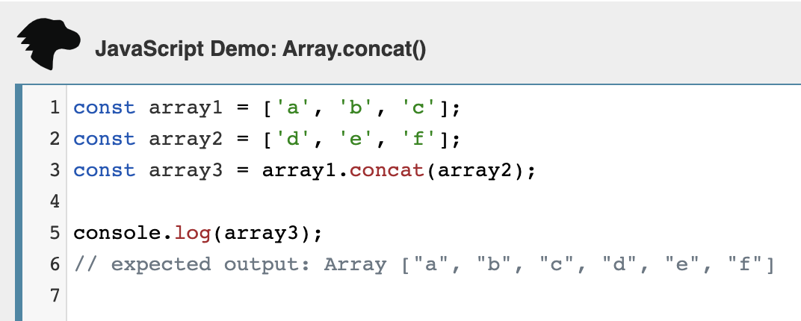

```javascript

.filter() //takes in an array, generartes new array of arbitrary length. This array will always contain elements from the first array, and builds the new array whenever the callback returns true. So I'm able to control waht goes into the new array.

.map() // takes in an array, generates a new array of the same length. It calls a provided callback function once for each element in the array, in order, and construts a new array from the results. "Function method" because it doesn't modify the original array

.reduce() //runs a callback function on each element of the array, returns a new "anything" based on the accumulator. Use to reshape data (like API's) Doesn't change the original array bc this is functional programming **left-to-right reduction

    //- the returned data is set using the accumalor set to an empty array [], object {}, string '', number (see line 22, 0 is the chosen accumulator for that function. Could be [] or {} depending on the desired results). Lets you reshape the data. Slapchop example from Nicholas.

    //Basic format for .reduce() accumulator and current value are require, index is optional depending on the use case
    array.reduce( (acc, val, ind) => {}, initialValue );

//See ShredTalk https://www.youtube.com/watch?v=_uICFozlNYE&list=PLVngfM2hsbi-L6G8qlWd8RyRbuTamHt3k&index=9&t=487s
```
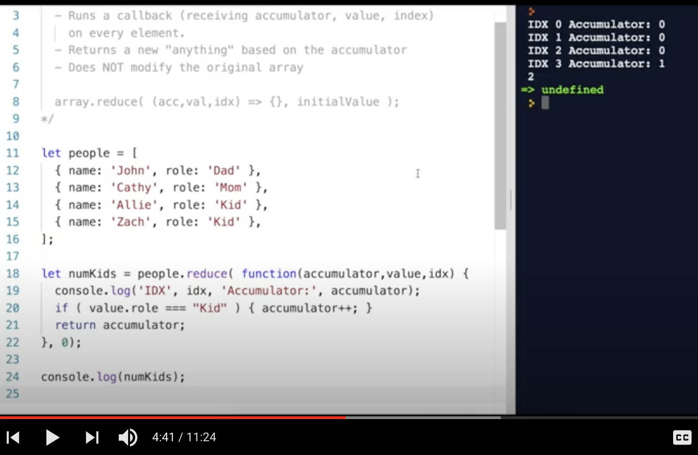
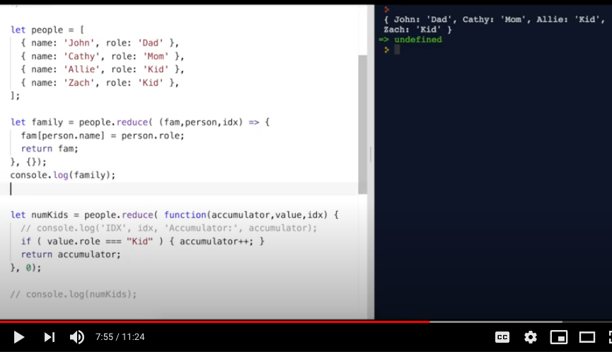
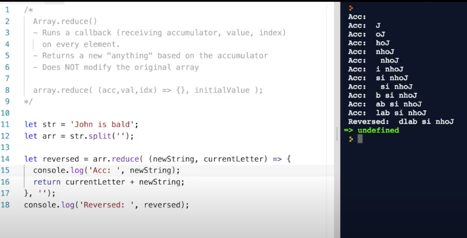
```javascript

.reduceRight() //applies a function against an accumulator and each value of the array (from right-to-left) to reduce it to a single value. 

```
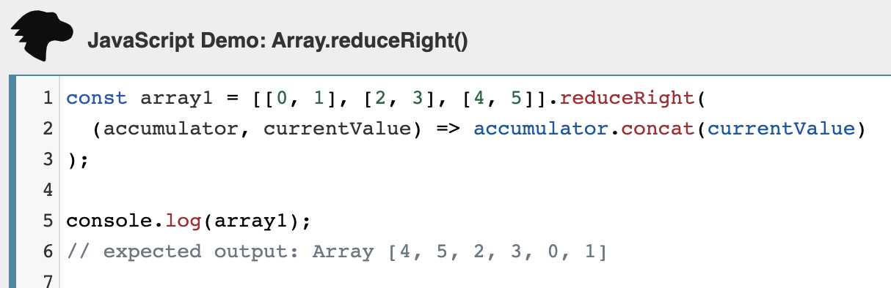
```javascript

.includes() //determines whether an array includes a certain value among its entries, returning true or false as appropriate.
```
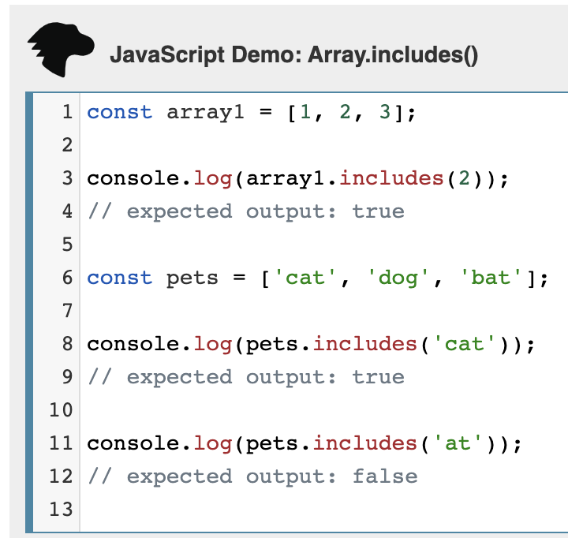

```javascript
.sort() //sorts an array

.split() //splits a String object into an array of string by separating the string into sub strings 

.splice() //method changes the contents of an array by removing or replacing existing elements and/or adding new elements in place.
let arrDeletedItems = arr.splice(start[, deleteCount[, item1[, item2[, ...]]]])
```
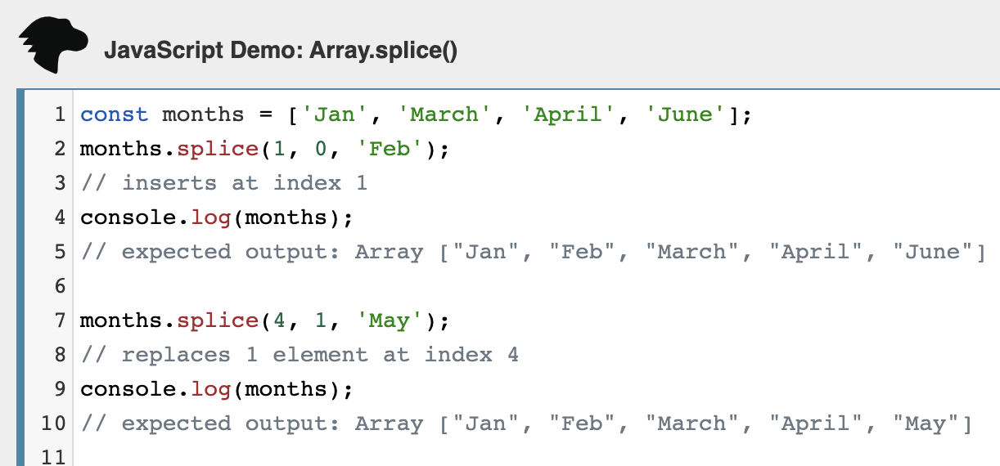
```javascript

    function returnTen(str) {
    // Solution code here...
    return str.split('').splice(-10);
    }//see Code Challenge 08 #1

.slice() //returns a shallow copy of a portion of an array into a new array object selected from start to end (end not included) where start and end represent the index of items in that array. The original array will not be modified.
    slice()
    slice(start)
    slice(start, end)
```
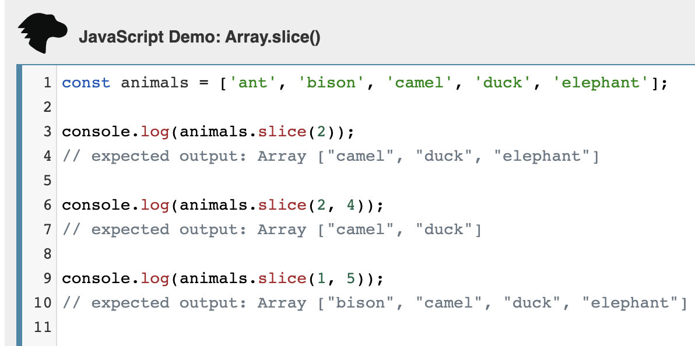
```javascript
.reverse() //reverses an array

.forEach() //loops over each value in the input array
.push() - //like i++, we push the results of the number and add 1

    const addOne = (arr) => {
      const result = [];
      arr.forEach(function(number) {
        result.push(number +1);
      });
      return result; 
    };

.length() //The length property of an object which is an instance of type Array sets or returns the number of elements in that array. The value is an unsigned, 32-bit integer that is always numerically greater than the highest index in the array.

.indexOf() //returns the first index at which a given element can be found in the array, or -1 if it is not present. (see MDN if example is needed)

.find() //returns the value of the first element in the provided array that satisfies the provided testing function. If no values satisfy the testing function, undefined is returned.
```
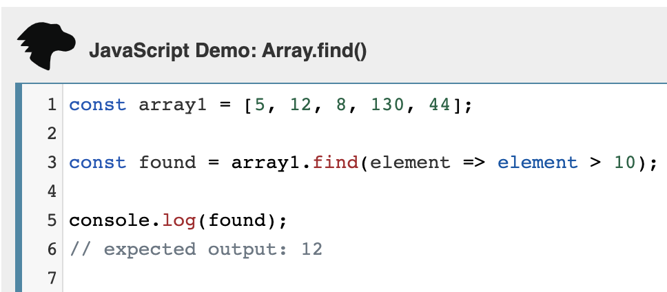
```javascript

.every() //tests whether all elements in the array pass the test implemented by the provided function. It returns a Boolean value.

//RegEx:
.match() //method retrieves the result of matching a string against a RegEx.
    const paragraph = 'The quick brown fox jumps over the lazy dog. It barked.';
    const regex = /[A-Z]/g;
    const found = paragraph.match(regex);

    console.log(found);
    // expected output: Array ["T", "I"]
.test() // method executes a search for a match between a RegEx and a specified string. Returns true or false.
    const containsW = (str) => {
    // Solution code here...
    const regTest = /w/gm;
    const outputTest = regTest.test(str);
    if (outputTest) {
        return true;
    } else {
        return false;
    }
};

.replace()//The replace() method returns a new string with some or all matches of a pattern replaced by a replacement. The pattern can be a string or a RegExp, and the replacement can be a string or a function to be called for each match. If pattern is a string, only the first occurrence will be replaced.
```
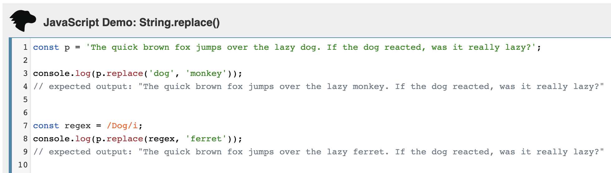

## Javascript string.prototype.methods:

```javascript

.toUpperCase() //method returns the calling string value converted to uppercase (the value will be converted to a string if it isn't one).

.toLowerCase() //makes the array all lower case

.replace()//The replace() method returns a new string with some or all matches of a pattern replaced by a replacement. The pattern can be a string or a RegExp, and the replacement can be a string or a function to be called for each match. If pattern is a string, only the first occurrence will be replaced.
```

```javascript

.length //The length property of a String object contains the length of the string, in UTF-16 code units. length is a read-only data property of string instances. See Code Challenge 06 #1
```

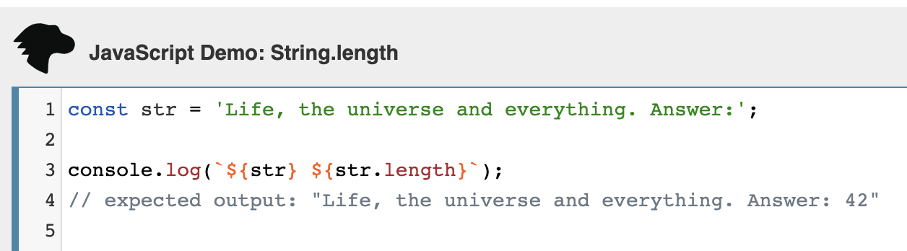

## Random:
```javascript
Math.pow(7, 3) // returns the base (7) to the 3rd power. 

Math.max() // returns the largest number

Math.abs() // returns absolute value
    var position1 = 5;
    var position2 = 300;
    var difference = position1 - position2;
    var magnitudeDifference = Math.abs(difference)
    console.log('magnitudeDifference:', magnitudeDifference);
//or 
    function getAbsoluteValue(num) {
    // create a result variable
    // assign it to absolutely value of input num
    var result = Math.abs(num);
    // return result
    return result;  
}

Math.ceil() //round up
    function roundUp(num) {
    // create a result variable
    // assign it to input, rounded down
    var result = Math.ceil(num);
    // return result
    return result;
    }
    
Math.floor() //round down
    function roundDown(num) {
    // create a result variable
    // assign it to input, rounded down
    var result = Math.floor(num);
    // return result
    return result;
    }

Math.random() //will generate a number between 0 and 1, could be 0 but will not be 1.
    function generateRandomNumber(min, max) {
    // create a result variable
    // assign it to formula for random number between min and max
    var result = Math.random() * (max - min) + min;
    // return result
    return result;
    }

Number.parseInt() // parse a string into a number, no decimal
var parsedInteger = Number.parseInt("49");
console.log('parsedInteger:', parsedInteger);

Number.parseFloat() // parse the string, including decimal
var parsedFloat = Number.parseFloat("29.45")
console.log('parsedFloat:', parsedFloat);

//Template Literals:
//Write a function that appends ' The end.' to a string, and returns the modified string. The original source string should not be modified.
const appendTheEnd = (str) => {
  // Solution code here...
  const str1 = `${str} The end.`;
  return str1;
}; //uses template literals (aka template strings) to append 'the end' to the string 


//Easy REVERSE array function:
const sortBackwards = (arr) => { //inverse of #3
    // Solution code here...
    arr.sort((a, b) => { return b - a; }); 
    return arr;
};
```


References:
MDN Web Docs: https://developer.mozilla.org/en-US/

freeCodeCamp.org: https://www.freecodecamp.org/news/how-to-reverse-a-string-in-javascript-in-3-different-ways-75e4763c68cb/