# 401 Javascript Pre-Work Notes

# Callbacks
[Shred Talk: Callbacks](https://youtu.be/xLDI7hIgU4o)

[Demo Code](https://codefellows.github.io/code-401-javascript-guide/curriculum/prework/callbacks/DEMO.html)

[My repl.it: Callbacks](https://replit.com/@NickiBaldwin/Callbacks#index.js)

### Notes from ShredTalk:

- Offload Functionality
- "Function, do your work ... and when you're done run this function for me."

Standard Callback Example:
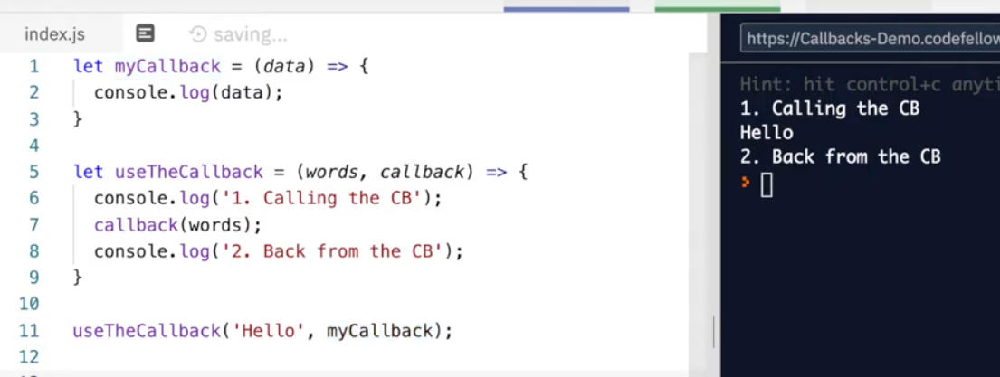

Error First Callbacks:
- Control data flow
- takes in two callbacks, error and data

Example of EF Callback
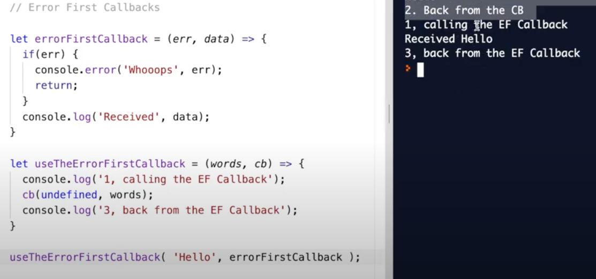
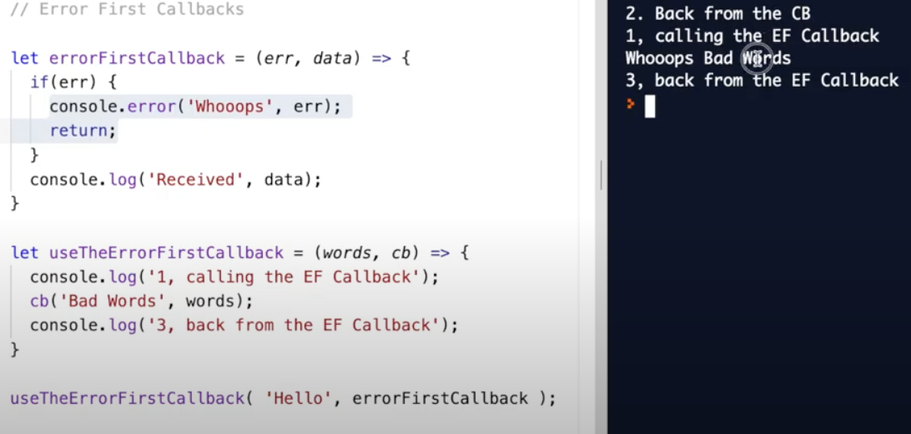

Async Example:
Use loupe to test/visually see the async code run (../async data flow)
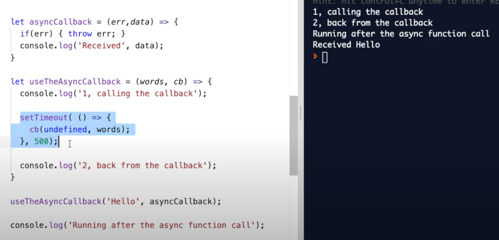

fs = File System Module for Node.js
```javascript
const fs = require('fs');
```
Node.js is made up of several libraries, allows you to bring in someone else's code. 
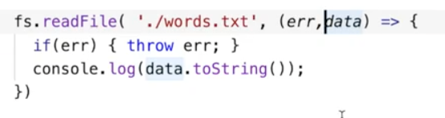
 

- words.txt file in replit said "some Random WordS!
- needed .toString() to show the string, without it threw the hex code for the characters. See ascii table for hex codes

Example of chaining two methods
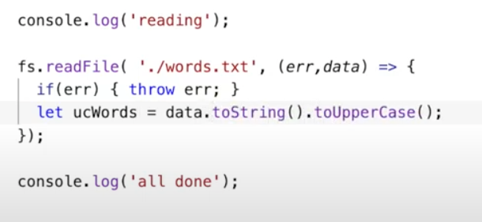

Below we changed the words.txt file from "SoMe RanDoM WoRds" to "SOME RANDOM WORDS"  

Line 56 read the file, is the callback

Line 59 uppercased it

Line 62 wrote it back, calling another function within the callback, also calling another callback

Line 65 read it back, and logs updated text to the console, also another function using a callback.

3 levels deep into Callbacks

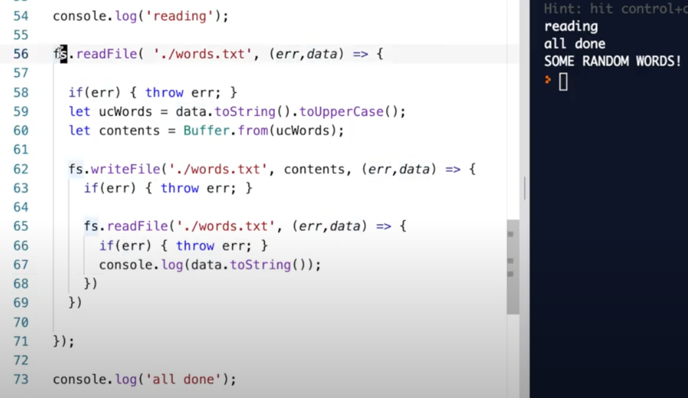

# Promises
[Shred Talk: Promises](https://www.youtube.com/watch?v=4bPdjAerRzQ)

[Demo Code](https://codefellows.github.io/code-401-javascript-guide/curriculum/prework/promises/DEMO.html)

[My repl.it: Promises](https://replit.com/@NickiBaldwin/Promises#index.js)

### Notes from ShredTalk:

"Function, please do your work, and when you finish .then() give me the data and I'll handle it."

- Feels more inline than callbacks
- Promises always (resolve, reject)

Example below is checking for correct data from API. The console.log(data.body) is where I write the code within the callback. .then() is a callback function. **needs a .catch()** as seen in 3rd example below

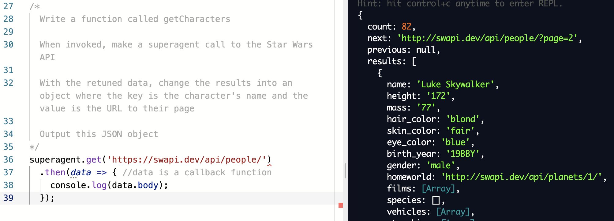

or more verbosely written below:

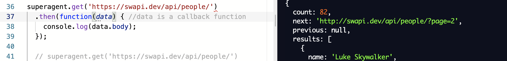

Standard example:
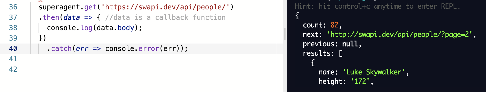

Promise() is a callback function, that takes in two parameters (resolve, reject)

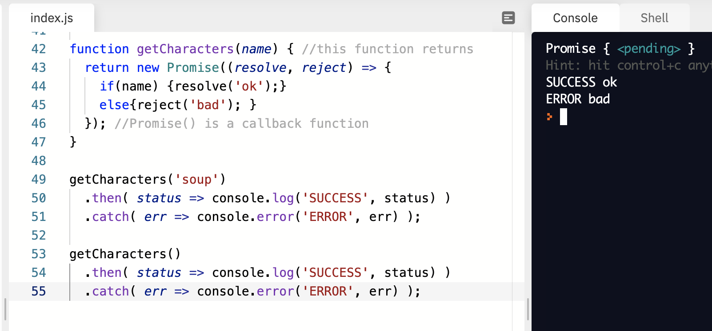
** bad variable names, but shows the callback function getCharacters() needs an input otherwise it throws an error.

Below is showing the speed in which the iterations return. It's async, so you can't gaurantee the order in which they will return to the callstack. The red on left is the iteration, but they rendered in order of fastest to slowest (../as shown in the green, ie 9 iteration 'Ok @ 10' i = 9 took 10 miliseconds to run)

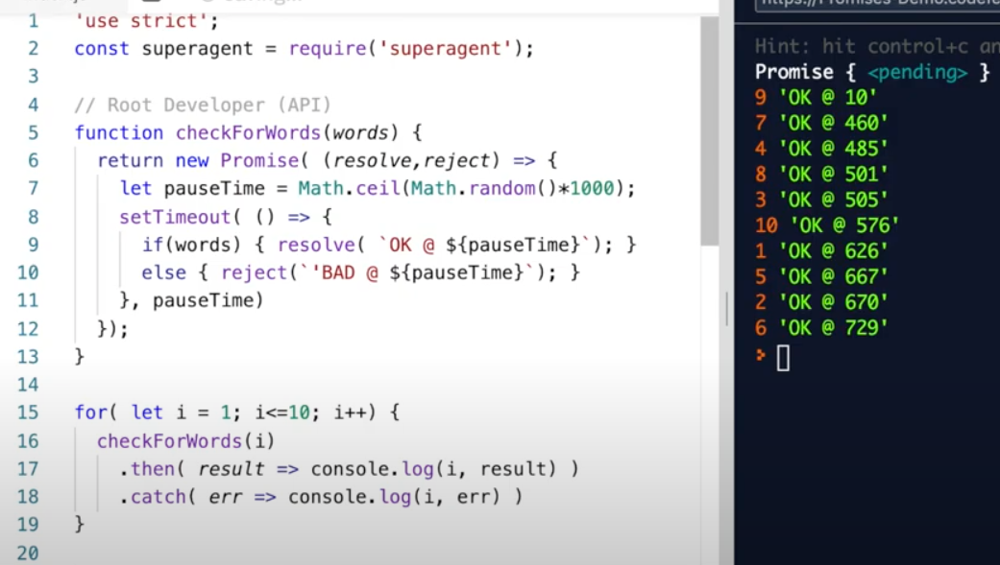

Alternatively to for loop (which runs nonsequencially, and returns fastest to slowest), we can use **promise chaining** as seen below, in which we force it to run in order and .then() it returns one Promise at a time. It takes longer, because it doesn't all run at once, it's line by line, but forces the order in which the callbacks run.

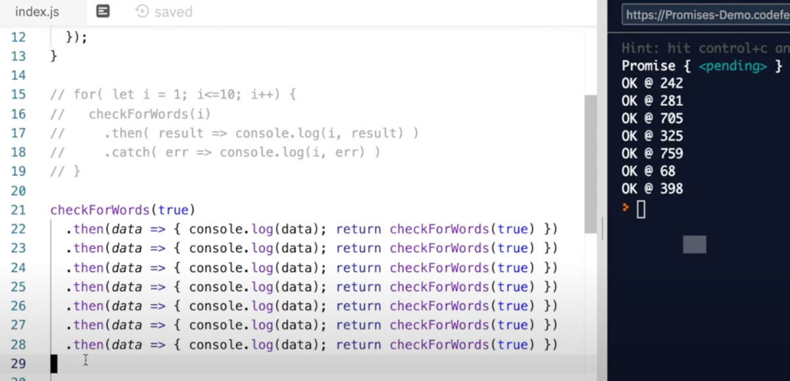

Forced an **error** which then jumps to the .catch()
- Iteration at 5 (on right side) is bad, because iteration at line 25 returned false, so the next lines callback is then going to fail and kick to the catch block.

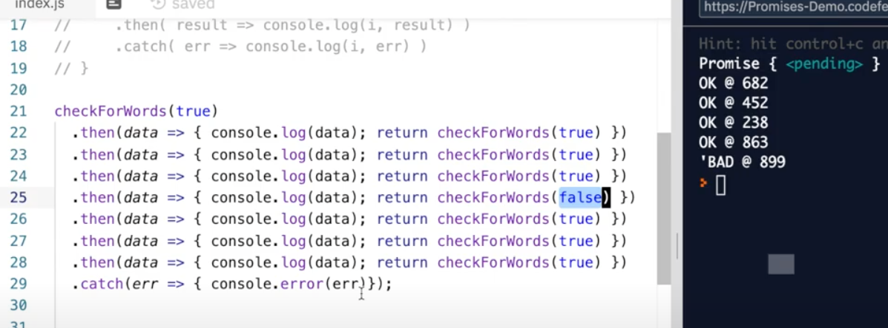

# Async/Await
[Shred Talk: Async/Await](https://youtu.be/o1B395-3Elg)

[Demo Code](https://codefellows.github.io/code-401-javascript-guide/curriculum/prework/async-await/DEMO.html)

[My repl.it: Async/Await](https://replit.com/@NickiBaldwin/AsyncAwait#index.js)

### Notes from ShredTalk:

"Hey JS this function is going to be asynchronous. When it runs, I'm going to wait until the long task finsihes, and then I'll take care of it inline."

  - looks like synchronous code when written, but with a few difference. Also looks cleaner. Similar to promises.

Similar to the promises example above, but written with arrow functions:
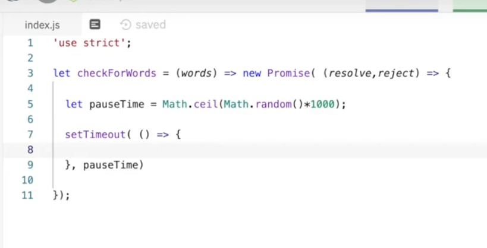

Cannot return value from Async function, it must be within the function. IE line 20 cannot return result, it doesn't work, use console.log.
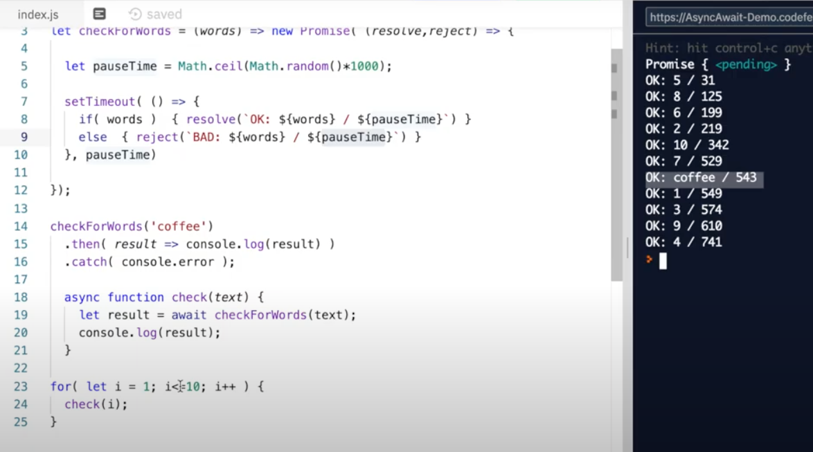
Async comes out in execution order - they enter the callback que in the order in which they complete, not the order in which they were created. IE the coffee result in the middle of the list

Promise.all() - use when the order produced matters, as seen below. Otherwise, call the async functions and let the event loop happen when it happens

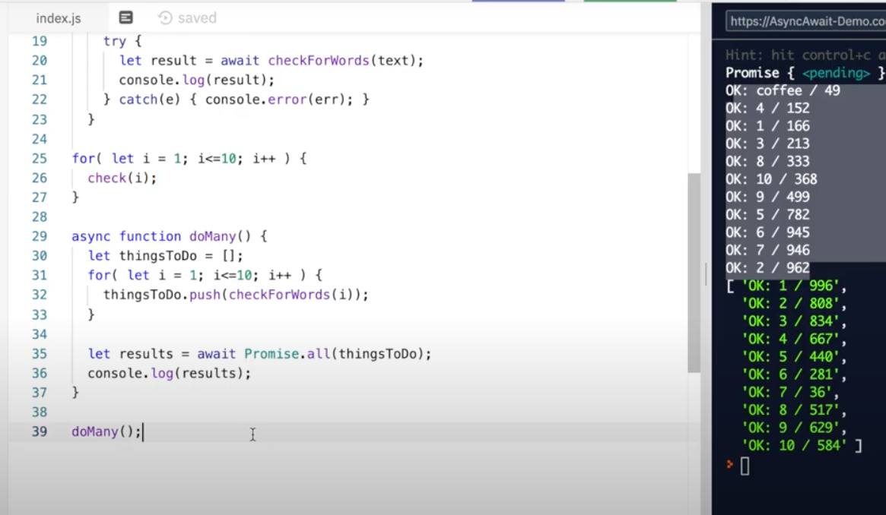


- In Async/Await we deal with the results within the async function code block. 

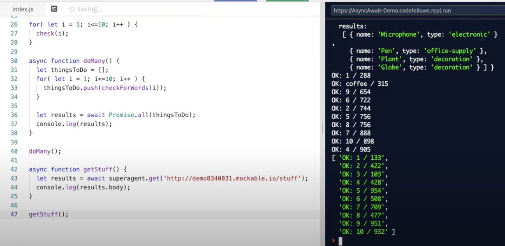

Async/Await are newer tech (so becoming more commonly used), will encounter promises more often. Callbacks are never going anywhere.

**Callbacks, promises, and async/await are 3 methods within JS to with to deal with asynchronous syntax. They all handle the event loop.**

# ES6 Classes & Data Modeling
[Shred Talk: ES6 Classes & Data Modeling](https://www.youtube.com/watch?v=9Yc5J3Ap9-4)

[Demo Code](https://codefellows.github.io/code-401-javascript-guide/curriculum/prework/classes/DEMO.html)

[My repl.it: ES6 Classes & Data Modeling](https://replit.com/@NickiBaldwin/ES6-Classes#index.js)

### Notes from ShredTalk:
#### Data Modeling:
  - Constructor Function and Prototypes
  - ES6

Data Modeling- think of modeling a real world object. Example of data modeling for a person:

  Person:
  - Attributes (nouns, things about you, describe): hair color, height, weight, location
  - Behaviors (verbs, methods): ability to walk(), speak(), drive()

Constructor function example (less effiecient, don't use):
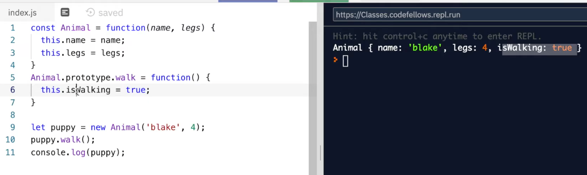

Using ES6 Classes (more efficient!!):


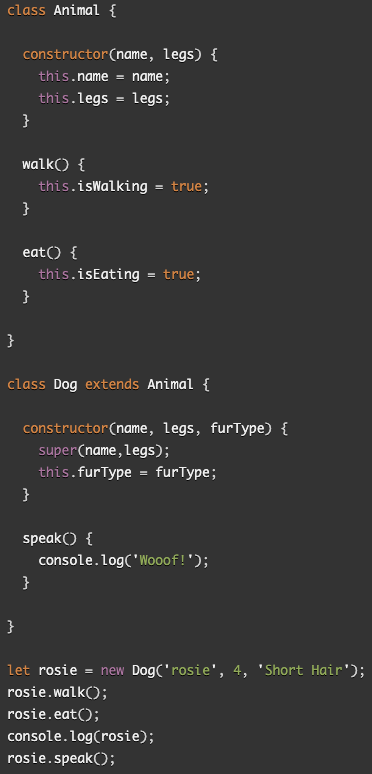


Class: Animal

Sub-Class: Dog

**extends** The extends keyword is used in class declarations or class expressions to create a class that is a child of another class.

class Vehicle {
  constructor(name, wheels) {
    this.name = name;
    this.wheels = wheels;
  }

  drive() {
    return 'Moving Forward' ;
  }

  stop() {
    return 'Stopping';
  }

}

class Car extends Vehicle {

  // constructor(name, wheels) {
  //   super(name, wheels);
  // }

}

class Motorcycle extends Vehicle {
  // constructor(name, wheels, wheelie) {
  //   super(name, wheels);
  // }

  wheelie() {return 'Wheee!';}
  

}
console.log('');
console.log('ES6 CLASSES');
console.log('');

let mazda = new Car('Mazda 3');
console.log('Car');
console.log('mazda.name', mazda.name );
console.log('mazda.drive()', mazda.drive() );
console.log('mazda.stop()', mazda.stop() );
console.log(mazda);

console.log('-------------------------------');

let harley = new Motorcycle('Fatboy');
console.log('Motorcycle');
console.log('harley.name', harley.name );
console.log('harley.drive()', harley.drive() );
console.log('harley.wheelie()', harley.wheelie() );
console.log('harley.stop()', harley.stop() );