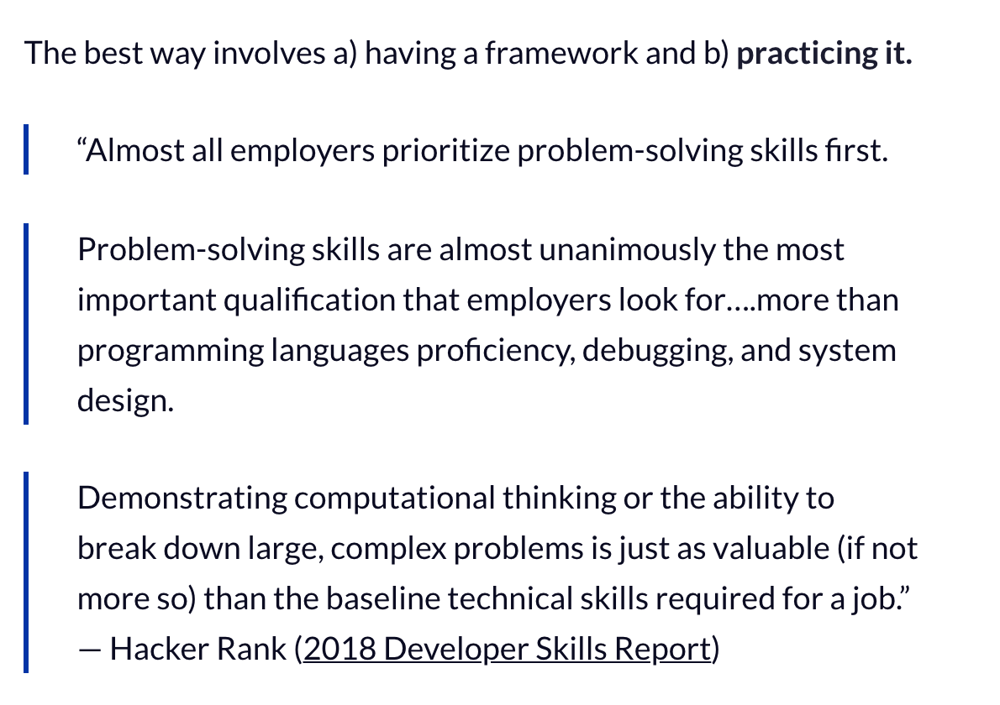
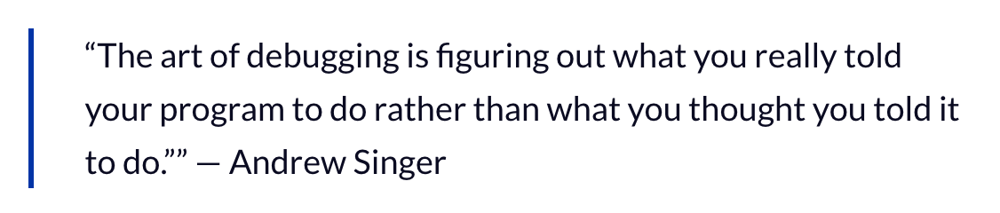

## [How to think like a programmer — lessons in problem solving](https://www.freecodecamp.org/news/how-to-think-like-a-programmer-lessons-in-problem-solving-d1d8bf1de7d2/)

- Programming is all about problem solving.

- "“The biggest mistake I see new programmers make is focusing on learning syntax instead of learning how to solve problems.” — V. Anton Spraul"

### Steps to Problem Solving

1. Understand

    - Know what is being asked. Most problems are hard bc of lack of understanding.

    - If I can explain the problem in plain english, then I truly understand the question.

    - Talk it out with someone or something, just talk it out, that usually finds the holes. (ie mine and Lydia and Jason's convos)

2. Plan

    - Don't just right in, take time to plan my solution.

    - Take time to write down the exact steps, don't just start throwing code out there.

    - "To get a good plan, answer this question:

      “Given input X, what are the steps necessary to return output Y?”"

3. Divide

    - Break down the problem into smaller probelms, big ones are too hard to solve.

    - Begin with the simplest problems.

    

4. Stuck?

    Steps to follow:

    - DEBUGGING

  

    - REASSESS

      - Take a step back and look through a different lens.

      - Sometimes that means starting fresh and rebuilding.

    - RESEARCH 

      - Consult the Google. Someone has already solved this problem.
      
      - "Caveat: Don’t look for a solution to the big problem. Only look for solutions to sub-problems. Why? Because unless you struggle (even a little bit), you won’t learn anything. If you don’t learn anything, you wasted your time."

**Practice!!!** To be a good problem solver, I need to solve a lot of problems.

  - Chess, Sudoku, video-games, code challenges. 

- Aim to solve one code challenge a day!

