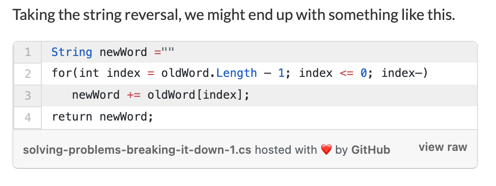

## [How to Solve Programming Problems](https://simpleprogrammer.com/solving-problems-breaking-it-down/)

- Whiteboard Interview:
  1. Read the problem completely twice.
  2. Solve the problem manually with 3 sets of sample data.
  3. Optimize the manual steps.
  4. Write the manual steps as comments or pseudo-code.
  5. Replace the comments or pseudo-code with real code.
  6. Optimize the real code.

  As much as 70% of our time should be spent in steps 1-3.

- **“Nothing can be automated that cannot be done manually!”**

### Solve the Problem Manually 
- "Solve a problem with at least 3 different inputs to make sure I fully understand the solution and that it will work for more than one case."

- Write out the solution step-by-step in plain english.
  - ie "If I give you a string “Zebra”, and ask you to reverse it, most people will do the following manual steps.
    - Write “Zebra” down.
    - Start a new word, and put “a” as the first letter.  (Why –> because it is the last letter, we want to start here)
    - Put “r” down as the 2nd letter.  (Why –> because it is the next letter backwards from the last letter we copied)
    - Put “b” down as the 3rd letter.  (Why –> same as above)
    - Etc"

### Optimize the manual solution

- It's easier to rearrange and reconstruct an idea in my head than it is in code.

- ie "Write “Zebra” down.
Start at the last letter in the word and create a new empty word.
Append the current letter to the new word
If there is a previous letter, make the previous letter the current letter and start back at 3."

- Above it's clear that we're going to write a loop- easier to see now than in previous example.

### Write pseudo-code or comments

- "What we want to do here is capture all the steps we created and now either put them into our editor as comments or write them as psuedo-code that we can translate to real code."

- This lays the structure, and plugging in the code later is much easier. An outline, if you will - ie

" // NewWord = “”

// Loop backwards through word to reverse

//   NewWord += CurrentLetter

// Return NewWord "

### Replace comments with real code

- This should be easy, assuming previous steps were done correctly. 

- If issues arise- I didn't break the problem down into simple enough steps
  - Go back and simplify further.

- OR I don't know the language well enough to do the conversion
  - Brush up on basic constructs:
    - "Create a list
    - Sort a list or array
    - Create a map or dictionary
    - Loop through a list, or dictionary
    - Parse strings
    - Convert from string to int, int to string, etc"
  - Know how to do the above for ANY language to solve algorithmic problems.

### Optimize real code

- Any fat to trim? Remove a few lines or do something simpler?

- Make sure variables are named with meaningful names.

SOLID VARIABLE AND METHOD NAMES === SUPER IMPORTANT
(for me to see my mistakes, and for others reading my code)

**"Divide and conquer" large porblems using the method above**
