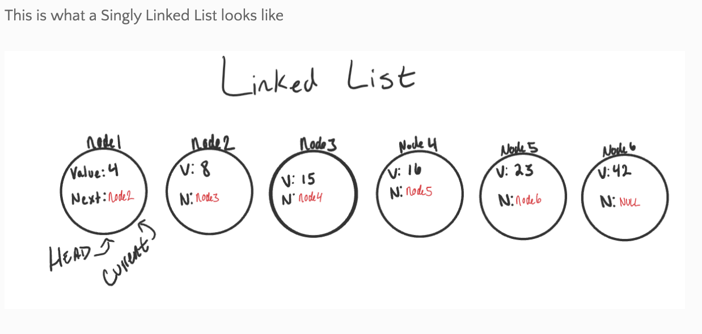
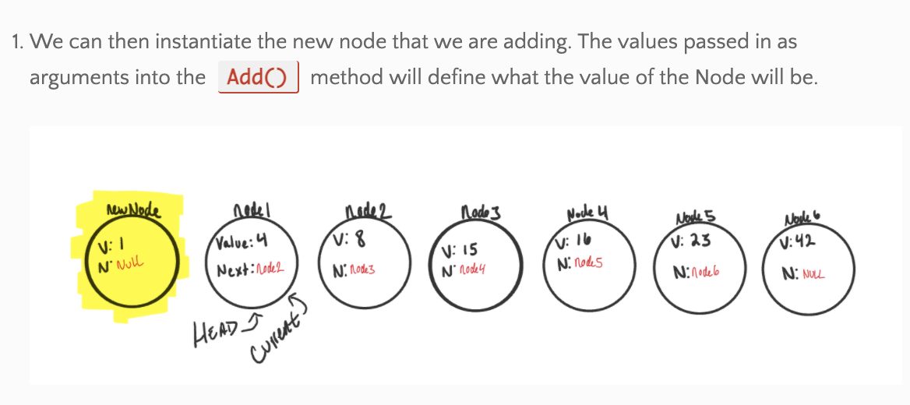
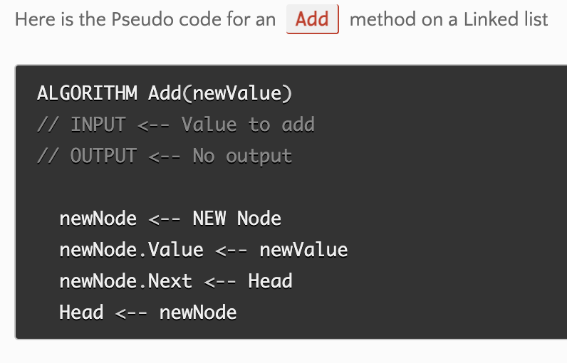
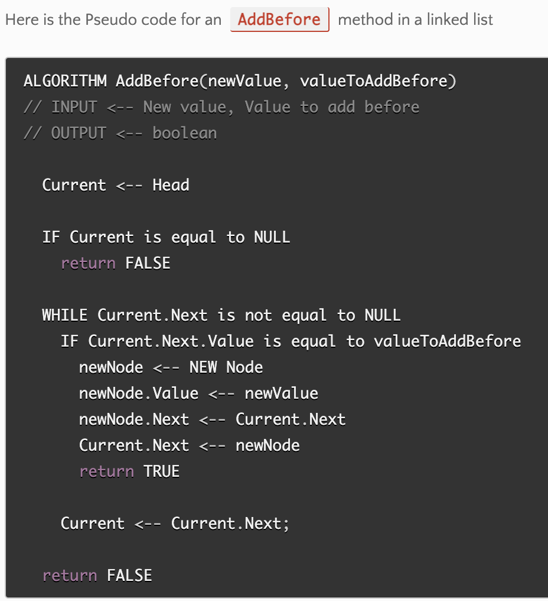
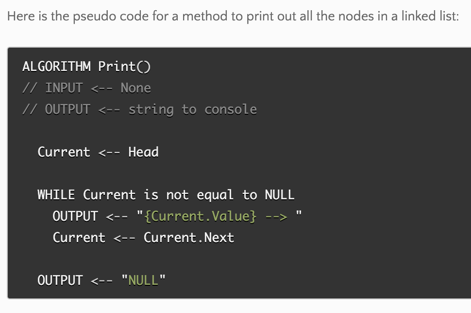
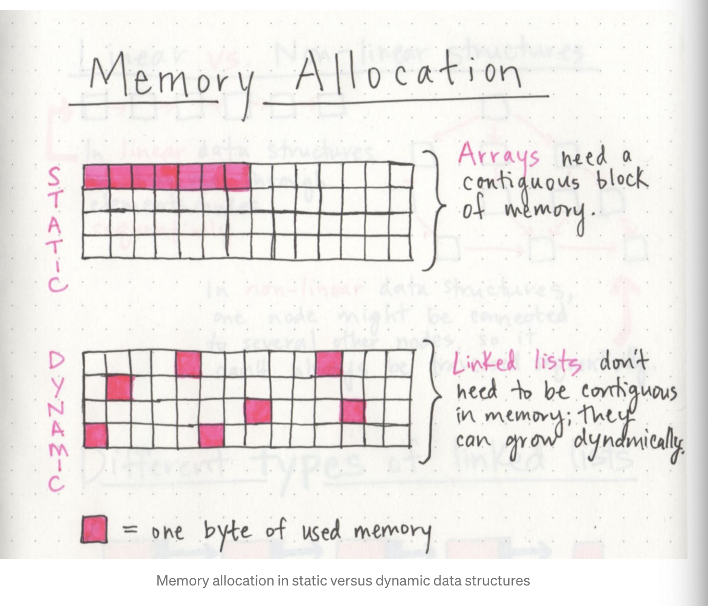

# Code 401: Advanced Software Development in Full-Stack Javascript

## Reading 04: Linked List

## [Linked List - Code Fellows](https://codefellows.github.io/common_curriculum/data_structures_and_algorithms/Code_401/class-05/resources/singly_linked_list.html)

- A Linked List is a squence of Nodes that are linked to each other. A Linked List feature is that each Node references the next Node in the link.

### 2 Types of linked list:

1. Singly - # of references a node has. Only one references, and it points to the next node in the linked list.
2. Doubly - 2 references within the node. There is reference to the next and previous node.

### Other Vocab:

- **Node:** Nodes are the individual items/links that line in a linked list. Each node contains the data for each link.

- **Next:** This property contain the reference to the next node.

- **Head:** Reference type of node to the first node in the linked list.

- **Current:** Referene type of node to the current being looked at. "When traversing, you create a new Current variable at the Head to guarantee you are starting from the beginning of the linked list."

### Traversal

- No forEach or for loops.

- Need Next for guidance to where the next reference is pointing. Needed for correct data extraction.

- Best way to traverse is a **while() loop.**

- **NullReferenceException**
  - If we accidentally end up trying to traverse on a node that is null, a NullReferenceException gets thrown and our program will crash/end.

- Current variable will tell us exactly where we are in the linked list.

- Traversal Big O - need Includes()

- Adding a Node - 
    O(1) - replaces current Head of linbked list with a new node, without losing the referene to the next node in the list.

AddAfter()

node# IE node4 or node6

AddBefore() :

#### Print out Nodes

# [What’s a Linked List, Anyway?](https://medium.com/basecs/whats-a-linked-list-anyway-part-1-d8b7e6508b9d)

 - Linear Data Structures - so squential 

 - Come up in tech 
 interviews - so study up!

 - Memory Management - the bytes of memory can be scattered throughout, not in a single block of memory.

 
