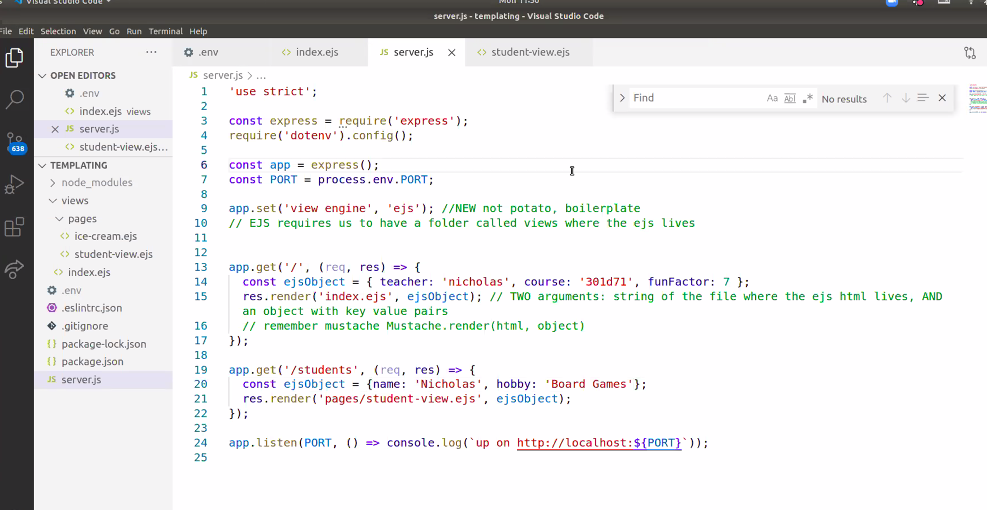

# Code 301
## Class 11: EJS

### Warm-Up:

[Bubble Sort Wiki](https://en.wikipedia.org/wiki/Bubble_sort)

- The biggest bubble floats to the top first, then iterates through array, then the second biggest floats to the top

- "Bubble sort, sometimes referred to as sinking sort, is a simple sorting algorithm that repeatedly steps through the list, compares adjacent elements and swaps them if they are in the wrong order. The pass through the list is repeated until the list is sorted. The algorithm, which is a comparison sort, is named for the way smaller or larger elements "bubble" to the top of the list.
This simple algorithm performs poorly in real world use and is used primarily as an educational tool. More efficient algorithms such as quicksort, timsort, or merge sort are used by the sorting libraries built into popular programming languages such as Python and Java."

## Setting up server: (FINAL)

- Front Row 3/1 @9:30am


<br/>
<br/>

### CRUD (Create. Read. Update. Delete.)

- Data cam be created, read, updated, or deleted.

- 

### SQL (insert/create, select, update, delete/drop)

### HTTP (Rest, Post, Get, Put, Delete)
Put is for updating (DO NOT USE TODAY)
Get is for reading (for lab 11)
Post creating new things (for lab 11)
Delete (DO NOT USE TODAY)

- We call the different ways we can send data the "method".
- Method for getting things off the internet is GET (aka reading)

- Rest === Representational state transfer. Follow the right patterns to be restful.

- Dry Code vs Wet Code? 


-boiler plate code (below)


express.urlencoded == bodyParser (from reading videos)// express automatically loads bodyParser as of now, urlencoded loads it for us now


## EJS:

- We could use EJS or Mustache, EJS is a templating library.

- Purpose of EJS is a library to use? It's like mustache but a different option

``` html

- <p><%= nameOfKeyGoesHere %></p>
- in mustache it would look like 
    <p>{{nameOfKeyHere}}</p>
``` 

The start of the EJS, boiler plate, I think

app.set('view engine', 'ejs') is boiler plate!


use index.ejs not .html


## FOR LAB

``` javasscript 


```




Above: redirect tells it to go look there

BOILER PLATE FOR LAB


Templating Demo:


End of demo


WRRC For Today:


Google API url: change to q=intitle:dune
or 
q=inauthor:frank herbert
(see below)


we need to add superagent

npm -i superagent
(i is short for install)


Code Challenges:
- regexlib.com
look up phone number
do not copy and paste, but type out


FINAL:
- 5 code challenges, rendomly generated for each student
- jQuery, .map, etc, 1 of each

- build a server that does a specific task

- we have until 6pm, estimated 6 hours to complete
- expected to be incomplete by 6pm thursday.


